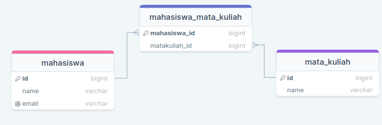

# Requirement 
Berikut ini yang harus dikuasai sebelum mempelajari JPA & Hibernate
 * Dasar-dasar java
 * maven
 * Memahami java database
 * jdbc
 * Junit
 * Mysql

# ORM(Object Relational Mapping)
Orm merupakan suatu teknik pemetaan atau teknik merubah suatu tabel menjadi Objct pada bahasa pemograman.  
Dengan menggunakan ORM kita dapat memmanipulasi data didalam database menggunakan object pada bahasa pemohraman  
ORM akan bertanggung jawab dalam melakukan sinkronisasi data yang kita ubah pada object dengan data di database, misalnya proses CRUD(Create Read Update Delete)
Dengan menggunakan ORM kita dapat memanipulasi data didalam database seperti kita memanipulasi data pada object, tampa harus menulis perinth SQL secara manual.

# JPA(Java Persistance API)
JPA adalah salah sastu standarisasi ORM(Object Relational Mapping) di bahasa pemograman JAVA  
JPA merupakan bagian dari JEE(Jakarta Enterprise Edition), JPA ini sangat populer digunakan oleh java programmer karena dengan menggunakan JPA java programmer dipermudah untuk melakukan Query ke database.  
[jakarta.ee](https://jakarta.ee/specifications/)

# Hibernate
JPA(Java Persistance Api) merupakan spesifikasi ORM pada bahasa pemograman java, artinya JPA hanyalah berisi kontrak interface dan untuk menggunakanya kita membutuhkan implementasinya atau membutuhkan Provider. 
terdapat banyak sekali JPA provider untuk saat ini, salah satunya yaitu [Hibernate](https://hibernate.org/orm/)

## Create Project
Untuk membuat Project kita dapat memanfaatkan https://start.spring.io dan jangan lupa tambahkan dependencies Mysql Driver dan Spring data JPA, Lombok

# @Entity
Annotation [@Entity](https://jakarta.ee/specifications/persistence/2.2/apidocs/javax/persistence/entity) merupakan annotation yang digunakan untuk merepresentasikan Tabel di database  
Class yang di annotasi @Entity merupakan class java bean yang mana semua property atau atribut nya memiliki seter dan getter, atribut atau property pada class tersebut merepresentasikan kolom pada database.  
Class yang dianotasi dengan @Entity wajib memiliki construtor yang tidak memiliki argumen, agar JPA dapat menginstansiasi object dengan tipe class tersebut tampa memberikan parameter ketika melakukan mapping dari data Table ke class Entity

``` java
package com.orm.jpaibbernate.jpahibbernate.entities;

import jakarta.persistence.Entity;
import lombok.Getter;
import lombok.NoArgsConstructor;
import lombok.Setter;

@Entity
// jangan luapa kita tambahkan costructor tampa parameter
// dan seter getter, disini kita dapat memanfatkan Lombok
@NoArgsConstructor @Setter @Getter
public class Customer {
    
    private String id;

    private String name;
}
```

Saat kita membuat class entity JPA mewajibkan class entity terebut memiliki primary key, walaupun pada postgresql atau mysql suatu tabel tidak diwajibkan memiliki primary key tapi di JPA setiap entity diwajibkan memiliki primary key  
Untuk memberikan primary key pada class entity kita bisa menggunkan annotation [@Id](https://jakarta.ee/specifications/persistence/2.2/apidocs/javax/persistence/id)

``` java
package com.orm.jpaibbernate.jpahibbernate.entities;

import jakarta.persistence.Entity;
import jakarta.persistence.Id;
import lombok.Getter;
import lombok.NoArgsConstructor;
import lombok.Setter;

@NoArgsConstructor
@Entity @Setter @Getter
public class Customer {
    
    @Id
    private String id;

    private String name;
}
```

Nama dari Entity atau tabel di database kita nanti diambil dari nama class entity nya, terkadang kita ingin mengubah nama entity tersenbut, untuk mengubah nama entity tersebut kita dapat menggunakan annotation [@Table](https://jakarta.ee/specifications/persistence/2.2/apidocs/javax/persistence/table) dan kita bisa masukan nama yang kita inginkan 

``` java
package com.orm.jpaibbernate.jpahibbernate.entities;

import jakarta.persistence.Entity;
import jakarta.persistence.Id;
import jakarta.persistence.Table;
import lombok.Getter;
import lombok.NoArgsConstructor;
import lombok.Setter;

@NoArgsConstructor @Table(name = "customers")
@Entity @Setter @Getter
public class Customer {
    
    @Id
    private String id;

    private String name;
}
```

# EntityManagerFactory
Hal pertama saat kita menggunakan JPA yaitu kita harus membuat object [EntityManagerFactory](https://jakarta.ee/specifications/persistence/2.2/apidocs/javax/persistence/entitymanagerfactory), Object EntityManagerFactory ini hanya perlu dibuat 1x karena object EntityManagerFactory ini sangatlah berat   
Untuk membuat EntityManagerFactory hal pertama yang harus dilakukan, yaitu kita harus membuat folder META-INF di dalam folder source, dan didalam folder META-INF kita buat file konfigurasinya dengan nama persistence.xml  
  

Dan setelah itu masukan configuration xml berikut ini
``` xml
<persistence 
            xmlns="http://xmlns.jcp.org/xml/ns/persistence" 
            xmlns:xsi="http://www.w3.org/2001/XMLSchema-instance"
            xsi:schemaLocation="http://xmlns.jcp.org/xml/ns/persistence
            http://xmlns.jcp.org/xml/ns/persistence/persistence_2_1.xsd"
            version="2.1"
            >
    <!-- ini untuk menamai persistance unit kita, misalnya disini namanya BELAJAR-JPA -->
    <!-- dan nantinya nama tersebut akan digunakan untuk mengambil instance EntityManagerFactory -->
    <persistence-unit name="BELAJAR-JPA">
        <provider>org.hibernate.jpa.HibernatePersistenceProvider</provider>

        <!-- class entity -->
        <!-- kita masukan semua entity class yang kita punya menggunakan tag <class> -->
        <class>com.orm.jpaibbernate.jpahibbernate.entities.Customer</class>

        <properties>
            <!-- disni kita konfigurasi database kita, misalnya seperti driver, username, dan password -->
            <property name="jakarta.persistence.jdbc.driver" value="com.mysql.cj.jdbc.Driver"></property>
            <property name="jakarta.persistence.jdbc.url" value="jdbc:mysql://localhost:3306/java_persistence_api"></property>
            <property name="jakarta.persistence.jdbc.user" value="root"></property>
            <property name="jakarta.persistence.jdbc.password" value="bagatal"></property>
        </properties>
    </persistence-unit>
</persistence>
```

Setelah itu, sebelum kita jalankan mari kita buatkan database nya terlebih dahulu(bebas mengguanakan DBeaver atau mysql workbeanch ataupun menggunakan terminal)
``` sql
CREATE DATABASE java_persistence_api;

USE java_persistence_api;

CREATE TABLE customers(
    id VARCHAR(10) NOT NULL,
    name VARCHAR(100) NOT NULL,
    PRIMARY KEY (id),
    CONSTRAINT unique_id UNIQUE (id)
)ENGINE innoDB;
```


Sebelumnya kita telah mengetahui bahwa object EntityManagerFactory sangatlah berat, alangkah baiknya kita membuatnya dengan pateren singleton agar object tersebut hanya dibuat 1x
``` java
package com.orm.jpaibbernate.jpahibbernate.utils;

import jakarta.persistence.EntityManagerFactory;
import jakarta.persistence.Persistence;

public class EntityManagerUtil {
    
    private static EntityManagerFactory entityManagerFactory;

    // dengan begini object EntityManagerFactory hanya dibuat 1x
    public static EntityManagerFactory getEntityManagerFactory() {
        if (entityManagerFactory == null) entityManagerFactory = Persistence.createEntityManagerFactory("BELAJAR-JPA");
        return entityManagerFactory;
    }
}
```

Setelah itu mari kita uji dengan menggunakan Junit untuk membuktikan bahwa object EntityManagerFactory berhasil dibuat
``` java
package com.orm.jpaibbernate.jpahibbernate;

import org.junit.jupiter.api.Assertions;
import org.junit.jupiter.api.Test;
import com.orm.jpaibbernate.jpahibbernate.utils.EntityManagerUtil;

public class EntityManagerFactoryTest {
    
    @Test
    public void testEntityManagetFactory() {
        EntityManagerFactory entityManager1 = EntityManagerUtil.getEntityManagerFactory();
        EntityManagerFactory entityManager2 = EntityManagerUtil.getEntityManagerFactory();

        Assertions.assertNotNull(entityManager1);
        Assertions.assertNotNull(entityManager2);
        Assertions.assertSame(entityManager1, entityManager2);
    }
}
```

# EntityMangerFactory
Jikalau DataSource digunakan untuk menejemn Connection, maka EntityManagerFactory ini digunakan untuk menejemen [EntityManager](https://jakarta.ee/specifications/platform/9/apidocs/jakarta/persistence/entitymanager)  
EntityManager ini digunakan saat kita ingin berintraksi dengan Database misalnya seperti :
 * CREATE
 * READ
 * UPDATE
 * DELETE
  
Setelah kita menggunakan EntityManger maka kita perlu menutupnya dengan memanggil method close()
``` java
package com.orm.jpaibbernate.jpahibbernate;

import org.junit.jupiter.api.Assertions;
import org.junit.jupiter.api.Test;
import com.orm.jpaibbernate.jpahibbernate.utils.EntityManagerUtil;
import jakarta.persistence.EntityManager;

public class EntityManagerTest {
    
    @Test
    public void testEntityManager() {
        // membuat instance EntityManager
        EntityManager entityManager = EntityManagerUtil.getEntityManagerFactory().createEntityManager();
        // operasi kueri

        // selesai
        entityManager.close();
        Assertions.assertNotNull(entityManager);
    }
}
```

# EntityTransaction
Transaction merupakan fitur yang paling sering kita pakai dikala mengembangkan applikasi yang berkomunikasi dengan database.  
Untuk melakukan transaction di jpa kita dapat menggunakan object [EntityTransaction](https://jakarta.ee/specifications/persistence/2.2/apidocs/javax/persistence/entitytransaction), Untuk nebdaoatkan obejct EntityTransaction kita menggunakan method getTransaction() milik EntityManager.  
``` java
package com.orm.jpaibbernate.jpahibbernate;

import org.junit.jupiter.api.Assertions;
import org.junit.jupiter.api.Test;
import com.orm.jpaibbernate.jpahibbernate.utils.EntityManagerUtil;
import jakarta.persistence.EntityManager;
import jakarta.persistence.EntityTransaction;

public class EntityTransactionTest {

    @Test
    public void testTransaction() {
        EntityManager entityManager = EntityManagerUtil.getEntityManagerFactory().createEntityManager();
        // mengambil object EntityTransaction
        EntityTransaction transaction = entityManager.getTransaction();
        
        try {
            transaction.begin();
            // operasi sql
           

            transaction.commit();
        } catch (Throwable throwable) {
            transaction.rollback();
        }
        entityManager.close();
        Assertions.assertNotNull(transaction);   
    }
}
```

# CRUD
Untuk melakukan operasi Create, Read, Update, Delete kita bisa menggunakan EntityManager, maka secara otomatis JPA akan membuatkan(mengenerate kan secara otomatis) perintah SQL query untuk INSERT, UPDATE, DELETE, SELECT.  
berikut ini adalah method yang bisa kita gunakan untuk melakukan query :
|   Method              |   Deskripsi                                              |
|-----------------------|----------------------------------------------------------|
|   persist(entity)     |   Menyimpan Entity/melakukan insert                      |
|   merge(entity)       |   Untuk melakukan Update                                 |
|   remove(entity)      |   Untuk menghapus Entity/data                            |
|   find(Class, id)     |   Untuk mgeambil Entity Berdasarkan Id/ melakukan select |

Sebelum kita melakukan query, coba kita aktifkan terlebih dahulu slq formater dan show sql milik hibernate agar perintah sql di tampilkan di konsol.  
Mari tambahkan property berikut pada tag \<properties>\</properties> pada file persistence.xml 

``` xml
<!-- konfigurasi hibernate -->
<properties>
    <!--digunakan untuk menampilkan sql ke konsol-->
    <property name="hibernate.show_sql" value="true"></property> 
    <!-- digunakan untuk memformat sql biar mudah dibaca di konsol-->
    <property name="hibernate.format_sql" value="true"></property>
</properties>
```

``` java
package com.orm.jpaibbernate.jpahibbernate;

import org.junit.jupiter.api.Assertions;
import org.junit.jupiter.api.BeforeEach;
import org.junit.jupiter.api.MethodOrderer;
import org.junit.jupiter.api.Order;
import org.junit.jupiter.api.Test;
import org.junit.jupiter.api.TestMethodOrder;
import com.orm.jpaibbernate.jpahibbernate.entities.Customer;
import com.orm.jpaibbernate.jpahibbernate.utils.EntityManagerUtil;
import jakarta.persistence.EntityManager;
import jakarta.persistence.EntityManagerFactory;
import jakarta.persistence.EntityTransaction;

@TestMethodOrder(value = MethodOrderer.OrderAnnotation.class)
public class CrudOperationTest {

    private EntityManagerFactory entityManagerFactory;

    @BeforeEach
    public void setUp() {
        entityManagerFactory = EntityManagerUtil.getEntityManagerFactory();
    }

    @Test @Order(value = 1)
    public void testInsert() {
        EntityManager entityManager = this.entityManagerFactory.createEntityManager();
        EntityTransaction transaction = entityManager.getTransaction();
        transaction.begin();
        Customer customer = new Customer();
        customer.setId("C001");
        customer.setName("Alliano");
        // melakukan insert ke database menggunakan method persist()
        entityManager.persist(customer);
        transaction.commit();
    }

    @Test @Order(value = 2)
    public void testUpdate() {
        EntityManager entityManager = this.entityManagerFactory.createEntityManager();
        EntityTransaction transaction = entityManager.getTransaction();
        transaction.begin();
        Customer customer = new Customer();
        // disini kita cukup memasukan primarykey dari data atau entity yang kita ingin update
        customer.setId("C001");
        customer.setName("Fara");
        // melakukan update
        Customer costumerUpdate = entityManager.merge(customer);
        Assertions.assertNotNull(costumerUpdate);
        Assertions.assertEquals("C001", costumerUpdate.getId());
        Assertions.assertEquals("Fara", costumerUpdate.getName());
        transaction.commit();
    }

    @Test @Order(value = 3)
    public void testSelect() {
        EntityManager entityManager = this.entityManagerFactory.createEntityManager();
        EntityTransaction transaction = entityManager.getTransaction();
        transaction.begin();
        Customer customer = entityManager.find(Customer.class, "C001");

        Assertions.assertNotNull(customer);
        Assertions.assertEquals("C001", customer.getId());
        Assertions.assertEquals("Fara", customer.getName());
        transaction.commit();
    }

    @Test @Order(value = 4)
    public void testDelete() {
        EntityManager entityManager = this.entityManagerFactory.createEntityManager();
        EntityTransaction transaction = entityManager.getTransaction();
        transaction.begin();
        Customer customer = entityManager.find(Customer.class, "C001");
        // menghapus data/entity
        entityManager.remove(customer);
        transaction.commit();
    }
}
```

# @Column
Secara default nama Attribut pada class entity akan di mapping sebagai nama column di Tabel, Namun terkadang nama atribut pada class entity berbeda dengan nama column pada tabel.  
Misalnya di class Entity menggunakan format cammelCase sedangkan di Table menggunakan snake_case.  
Untuk kasus tersebut kita bisa menggunakan Annotation [@Column](https://jakarta.ee/specifications/persistence/2.2/apidocs/javax/persistence/column)  

Misalnya kita akan menambahkan 1 kolom pada tabel dan kolom tersebut menggunakan format snake_case
``` sql
ALTER TABLE customers ADD COLUMN primary_email VARCHAR(50), ADD CONSTRAINT unique_email UNIQUE(primary_email);
```

``` java
package com.orm.jpaibbernate.jpahibbernate.entities;

import jakarta.persistence.Column;
import jakarta.persistence.Entity;
import jakarta.persistence.Id;
import jakarta.persistence.Table;
import lombok.Getter;
import lombok.NoArgsConstructor;
import lombok.Setter;

@NoArgsConstructor @Table(name = "customers")
@Entity @Setter @Getter
public class Customer {
    
    @Id @Column(name = "id")
    private String id;

    @Column(name = "name")
    private String name;

    // dengan demikian atribut primaryEmail akan di mapping menjadi primary_email saat dikirimkan ke sql
    @Column(name = "primary_email")
    private String primaryEmail;
}
```

``` java
package com.orm.jpaibbernate.jpahibbernate;

import org.junit.jupiter.api.BeforeEach;
import org.junit.jupiter.api.Test;
import com.orm.jpaibbernate.jpahibbernate.entities.Customer;
import com.orm.jpaibbernate.jpahibbernate.utils.EntityManagerUtil;
import jakarta.persistence.EntityManager;
import jakarta.persistence.EntityManagerFactory;
import jakarta.persistence.EntityTransaction;

public class ColumnAnnotationTest {

    private EntityManagerFactory entityManagerFactory;

    @BeforeEach
    public void setUp() {
        this.entityManagerFactory = EntityManagerUtil.getEntityManagerFactory();
    }

    @Test
    public void testColumnAnnotation() {
        EntityManager entityManager = this.entityManagerFactory.createEntityManager();
        EntityTransaction transaction = entityManager.getTransaction();
        transaction.begin();
        Customer customer = new Customer();
        customer.setId("C002");
        customer.setName("Naila");
        customer.setPrimaryEmail("naila@gmail.com");
        entityManager.persist(customer);
        transaction.commit();
    }
}
```

# GeneratedValue
kebanyakan DBMS memiliki fitur untuk mengeneratekan nilai untuk primary key secara otomatis, misalya kalo di mysql ada fitur yang namanya AUTO_INCREMENT, atau kalo di postgresql ada fitur yang namanya SEQUENCE.  
Fitur tersebut juga disediakan oleh JPA, kita bisa memanfaatkannya dengan menggunakan annotation [@GeneratedValue](https://jakarta.ee/specifications/persistence/2.2/apidocs/javax/persistence/generatedvalue) pada atribut yang di annotasi sebagai @Id, dnegan begitu JPA akan mengeneratekan value secara otomatis dan di Inject kedalam atribut tersebut  

Terdapat beberapa [strategy](https://jakarta.ee/specifications/persistence/2.2/apidocs/javax/persistence/generationtype) untuk mengenerate value secara otomatis :
 * SEQUENCE
 * IDENTITY
 * AUTO
 * UUID
 * TABLE


Misalnya disini kita memiliki tabel customers, dan memiliki ID sebagai PRIMARY KEY dengan tipe VARCHAR/String
``` sql
CREATE TABLE categories(
    id VARCHAR(100) NOT NULL,
    name VARCHAR(100),
    description TEXT,
    PRIMARY KEY (id)
) ENGINE InnoDb;
```
Berikut ini adalah Entity class nya
``` java
package com.orm.jpaibbernate.jpahibbernate.entities;

import jakarta.persistence.Entity;
import jakarta.persistence.GeneratedValue;
import jakarta.persistence.GenerationType;
import jakarta.persistence.Id;
import jakarta.persistence.Table;
import lombok.Getter;
import lombok.NoArgsConstructor;
import lombok.Setter;

@NoArgsConstructor @Table(name = "categories")
@Entity @Setter @Getter
public class Category {
    
    @Id @GeneratedValue(strategy = GenerationType.UUID)
    private String Id;

    private String name;

    private String description;
}
```

``` java
package com.orm.jpaibbernate.jpahibbernate;

import java.util.List;

import org.junit.jupiter.api.BeforeEach;
import org.junit.jupiter.api.Test;
import com.orm.jpaibbernate.jpahibbernate.entities.Category;
import com.orm.jpaibbernate.jpahibbernate.utils.EntityManagerUtil;
import jakarta.persistence.EntityManager;
import jakarta.persistence.EntityManagerFactory;
import jakarta.persistence.EntityTransaction;

public class GeneratedValueTest {

    private EntityManagerFactory entityManagerFactory;

    @BeforeEach
    public void setUp() {
        this.entityManagerFactory = EntityManagerUtil.getEntityManagerFactory();
    }

    @Test
    public void testGeneratedValue() {
        EntityManager entityManager = this.entityManagerFactory.createEntityManager();
        EntityTransaction transaction = entityManager.getTransaction();
        transaction.begin();
        Category category = new Category();
        // Disini kita tidak meng set Id nya, karena Id nya
        // secara otomatis di generate kan
        category.setName("Smartpone");
        category.setDescription("some description here");
        entityManager.persist(category);
        transaction.commit();
    }
}
```

# Conversion data type
JPA secara otomatis akan melakukan mapping tipe data dari class entity ke tabel.  
Tipe data dasar pada java misalnya seperti :
 * Boolean
 * Byte
 * BigInteger
 * BigDecimal
 * Short
 * Long
 * Double
 * Float
 * Integer

Telah didukung oleh JPA, jadi hal yang harus kita lakukan ketika ingin melakukan operasi CRUD, yaitu menyamakan tipe data pada class entity dengan kolom pada tabel di database.

Misalnya disini kita akan menambahakan kolom age denga tipe TINYINT dan meried dengan tipe BOOLEAN pada tabel customer
``` sql
ALTER TABLE customers ADD COLUMN age TINYINT, ADD COLUMN meried BOOLEAN;
```

Dan kita dapat membaut class Entity nya seperti berikut ini
``` java
package com.orm.jpaibbernate.jpahibbernate.entities;

import jakarta.persistence.Column;
import jakarta.persistence.Entity;
import jakarta.persistence.Id;
import jakarta.persistence.Table;
import lombok.Getter;
import lombok.NoArgsConstructor;
import lombok.Setter;

@NoArgsConstructor @Table(name = "customers")
@Entity @Setter @Getter
public class Customer {
    
    @Id @Column(name = "id")
    private String id;

    @Column(name = "name")
    private String name;

    @Column(name = "primary_email")
    private String primaryEmail;
    
    @Column(name = "meried")
    private Boolean meried; 

    // disini kita menggunakan Byte karena byte merepresentasiman nilai yang kecil
    @Column(name = "age")
    private Byte age; 
}
```
Setalh itu kita dapat mengujinya dengan Junit
``` java
package com.orm.jpaibbernate.jpahibbernate;

import java.util.List;

import org.junit.jupiter.api.Assertions;
import org.junit.jupiter.api.BeforeEach;
import org.junit.jupiter.api.MethodOrderer;
import org.junit.jupiter.api.Test;
import com.orm.jpaibbernate.jpahibbernate.entities.Customer;
import com.orm.jpaibbernate.jpahibbernate.utils.EntityManagerUtil;
import jakarta.persistence.EntityManager;
import jakarta.persistence.EntityManagerFactory;
import jakarta.persistence.EntityTransaction;

@TestMethodOrder(value = MethodOrderer.OrderAnnotation.class)
public class DataTypeTest {

    private EntityManagerFactory entityManagerFactory;

    @BeforeEach
    public void setUp() {
        this.entityManagerFactory = EntityManagerUtil.getEntityManagerFactory();
    }

    @Test
    public void testDataType() {
      EntityManager entityManager = this.entityManagerFactory.createEntityManager();
      EntityTransaction transaction = entityManager.getTransaction();
      transaction.begin();
      Customer customer = new Customer();
      customer.setId("C003");
      customer.setName("Uchiha Itachi");
      customer.setPrimaryEmail("itachiUchiha@akatsuki.ac.id");
      customer.setMeried(false);
      // Saat proses insert, attribut age akan di konversi ke TINYINT oleh jpa
      customer.setAge((byte)32);
      Assertions.assertDoesNotThrow(() -> entityManager.persist(customer));
      transaction.commit();
    }
}
```

# Enumerated
Kita telah mengetahui bahwa di java terdapat tipe data ENUM untuk menyimpan beberapa nilai, misalnya kita bisa manfaatkan untuk menyimpan type customer yang mana type customer tersebut akan menyimpan beberapa value :
 * SILVER
 * GOLD
 * PREMIUM

JPA juga mendukung type enum, hanya saja saat akan menyimpan type tersebut kedalam database kita beritahu JPA bagaimana cara menyimpan data tersebut denga menggunakan annotasi [@Enumerated](https://jakarta.ee/specifications/persistence/3.1/apidocs/jakarta.persistence/jakarta/persistence/enumerated)  

Cara menyimpan data Enum di jpa ada 2 [strategy](https://jakarta.ee/specifications/persistence/3.1/apidocs/jakarta.persistence/jakarta/persistence/enumType) :
|   strategy    | deskripsi                                  |
|---------------|--------------------------------------------|
|   ORDINAL     | Data akan disimpan dalam tipe angka        |
|   STRING      | Data akan disimpan dalam tipe VARCHAR      |

Misalnya disini kita akan menambahkan kolom type di tabel customer pada database
``` sql
ALTER TABLE customers ADD COLUMN type ENUM('SILVER', 'GOLD', 'PREMIUM');
```

Dan kita akan membuat class enum untuk merepresentasikan ENUM yang baru saja kita buat di database
``` java
package com.orm.jpaibbernate.jpahibbernate.entities;

public enum CustomerType {
    SILVER, GOLD, PREMIUM
}
```

Pada class Entity customer kita bisa menambahkan atribut denga tipe CustomerType yang baru saja kita buat dan kita annotasi denga @Enumerated
``` java
package com.orm.jpaibbernate.jpahibbernate.entities;

import jakarta.persistence.Column;
import jakarta.persistence.Entity;
import jakarta.persistence.EnumType;
import jakarta.persistence.Enumerated;
import jakarta.persistence.Id;
import jakarta.persistence.Table;
import lombok.Getter;
import lombok.NoArgsConstructor;
import lombok.Setter;

@NoArgsConstructor @Table(name = "customers")
@Entity @Setter @Getter
public class Customer {
    
    @Id @Column(name = "id")
    private String id;

    @Column(name = "name")
    private String name;

    @Column(name = "primary_email")
    private String primaryEmail;
    
    @Column(name = "meried")
    private Boolean meried; 

    @Column(name = "age")
    private Byte age; 

    /**
     * pada atribut type ini kita beritahu bahagaimana cara menyimpan/mapping
     * data tersebut kedalam database denga menggunakan annotasi 
     * @Enumerated dengan menggunakan Strategy STRING
     */
    @Enumerated(value = EnumType.STRING)
    private CustomerType type;
}
```

``` java
package com.orm.jpaibbernate.jpahibbernate;

import org.junit.jupiter.api.BeforeEach;
import org.junit.jupiter.api.Test;
import com.orm.jpaibbernate.jpahibbernate.entities.Customer;
import com.orm.jpaibbernate.jpahibbernate.entities.CustomerType;
import com.orm.jpaibbernate.jpahibbernate.utils.EntityManagerUtil;
import jakarta.persistence.EntityManager;
import jakarta.persistence.EntityManagerFactory;
import jakarta.persistence.EntityTransaction;

public class EnumTypeTest {

    private EntityManagerFactory entityManagerFactory;

    @BeforeEach
    public void setUp() {
        this.entityManagerFactory = EntityManagerUtil.getEntityManagerFactory();
    }

    @Test
    public void testEnumType() {
        EntityManager entityManager = this.entityManagerFactory.createEntityManager();
        EntityTransaction transaction = entityManager.getTransaction();
        transaction.begin();
        Customer customer = new Customer();
        customer.setId("C004");
        customer.setName("Izumi");
        customer.setPrimaryEmail("izunauchiha@uchiha.com");
        customer.setAge((byte)20);
        customer.setType(CustomerType.SILVER);
        entityManager.persist(customer);
        transaction.commit();
    }
}
```

# Date & Time
JPA juga mendukung mapping tipe data DATE dan TIME secara otomatis misalnya :
 * Date
 * Timestamp
 * Calendar
 * LocalDateTime
 * dan sebagainya

Berikut ini merupakan mapping Date Time di database 
| Java Class                 |   Tipe Data pada Database       |
|----------------------------|---------------------------------|
|   java.sql.Date            |  Date                           |
|   java.time.LocalDate      |  Date                           |
|   java.sql.Time            |  Time                           |
|   java.time.LocalTime      |  Time                           |
|   java.sql.Timestamp       |  Timestamp                      |
|   java.time.Instant        |  Timestamp                      |
|   java.time.LocalDateTime  |  Timestamp                      |
|   java.time.OffsetDateTime |  Timestamp                      |
|   java.time.ZonedDateTime  |  Timestamp                      |

Namun bagaimana denga tipe data java.util.Date dan java.util.Calendar, kedua tipe data tersebut membingungkan karena dapat digunakan untuk tipe data Date, Time, dan Timestamp didalam Daatabase.  
Oleh karena itu sangat disarankan menggunakan dari package java.time bukan java.util.  
Namun kalo lu kekeh pen make yang dari java.util maka, tambahkan annotasi [@Temporal](https://jakarta.ee/specifications/persistence/2.2/apidocs/javax/persistence/temporal) untuk memberitahu database detail dari [tipe data](https://jakarta.ee/specifications/persistence/2.2/apidocs/javax/persistence/temporaltype) yang digunakan untuk menyimpan data tersebut di database.  

Misalnya disini kita akan menambahkan kolom created_at dan updated_at pada tabel categories
``` sql
ALTER TABLE categories ADD COLUMN updated_at TIMESTAMP, ADD COLUMN created_at TIMESTAMP;
```
Dan pada class Entity Category kita tambahkan 2 attribut yaitu created_at dan updated_at
``` java
package com.orm.jpaibbernate.jpahibbernate.entities;

import java.time.LocalDateTime;
import java.util.Calendar;
import jakarta.persistence.Column;
import jakarta.persistence.Entity;
import jakarta.persistence.GeneratedValue;
import jakarta.persistence.GenerationType;
import jakarta.persistence.Id;
import jakarta.persistence.Table;
import jakarta.persistence.Temporal;
import jakarta.persistence.TemporalType;
import lombok.Getter;
import lombok.NoArgsConstructor;
import lombok.Setter;

@NoArgsConstructor @Table(name = "categories")
@Entity @Setter @Getter
public class Category {
    
    @Id @GeneratedValue(strategy = GenerationType.UUID)
    private String Id;

    private String name;

    private String description;

    /**
     * Disini kita perlu memberikan annotasi @Temporal
     * untuk memberi tau JPA bahwa data ini akan di mappring
     * menjadi tipe data apa(dalam kasus ini kita akan mapping menjadi TIMESTAMP)
     * dengan begitu Database tidak akan bingung
     */
    @Temporal(value = TemporalType.TIMESTAMP)
    @Column(name = "updated_at")
    private Calendar updatedAt;

    /**
     * pada attribut ini kita tidak perlu menambahkan annotasi
     * @Temporal, karena secara otomatis JPA mengetahui akan di mapping
     * menjadi tipe data apa(Timestamp)
     * karena LocalDateTime dari padkage java.time
     */
    @Column(name = "created_at")
    private LocalDateTime createdAt;
}
```

``` java
package com.orm.jpaibbernate.jpahibbernate;

import java.time.LocalDateTime;
import java.util.Calendar;
import org.junit.jupiter.api.BeforeEach;
import org.junit.jupiter.api.Test;
import com.orm.jpaibbernate.jpahibbernate.entities.Category;
import com.orm.jpaibbernate.jpahibbernate.utils.EntityManagerUtil;
import jakarta.persistence.EntityManager;
import jakarta.persistence.EntityManagerFactory;
import jakarta.persistence.EntityTransaction;

public class DateTimeTest {
    
    private EntityManagerFactory entityManagerFactory;

    @BeforeEach
    public void setUp() {
        this.entityManagerFactory = EntityManagerUtil.getEntityManagerFactory();
    }

    @Test
    public void testDateTime() {
        EntityManager entityManager = this.entityManagerFactory.createEntityManager();
        EntityTransaction transaction = entityManager.getTransaction();
        transaction.begin();
        Category category = new Category();
        category.setName("Some Category name");
        category.setDescription("Some description");
        category.setCreatedAt(LocalDateTime.now());
        category.setUpdatedAt(Calendar.getInstance());
        entityManager.persist(category);
        transaction.commit();
    }
}
```

# Large Object
Seperti yaang kita ketahui bahwa database dapat menyimpan Data berupa object yang sangat besar misal nya BLOB(Binary Lage Object) atau CLOB(Character Lagrge Object).  
 * BLOB adalah tipe data untuk menyimpan data binary sekala besar misalnya Video, Foto, Audio dan sebagainya
 * CLOB adalah tipe data untuk menyimpan data text yang bersekala besar

Blob di java di represetsikan oleh class java.sql.Blob, dan Clob di represetasikan java.sql.Clob  
Namun saat kita menggunakan java.sql.Blob dan java.sql.Clob itu agak menyulitkan kerena kita harus membaca file nya secara manual menggunakan java IO  
Untungnya JPA dapat mengkonversi secara otomatis tipe data BLOB menjadi tipe data yang familiar di JAVA misalnya byte[]  
  
Untuk tipe CLOB juga JPA dapat mengkonversinya secara otomatis menjadi tipe data String atau char[]  
Jika kita menggunakan tipe data ini(Char[], byte, String) untuk menyimpan BLOB atau CLOB maka, kita perlu menambahkan annotation [@Lob](https://jakarta.ee/specifications/persistence/3.1/apidocs/jakarta.persistence/jakarta/persistence/lob), yang tujuanya agar JPA tau bahwa data ini meruakan LARGE OBJECT.  
  
Misalnya kita disini memiliki tabel Admin dan memiliki atribut id, name, picture, description
``` sql
CREATE TABLE admins(
    id VARCHAR(100) NOT NULL,
    name VARCHAR(100),
    picture BLOB,
    description TEXT
)ENGINE InnoDB;
```

Dan untuk Class entity nya pada atribut image dan description kita akan berikan annotasi @Lob, yang tujuanya agar JPA tau bahwa atribut ini akan memuat Large Object, dengan begitu JPA akan mengkonversi data tersebut menjadi BLOB.
``` java
package com.orm.jpaibbernate.jpahibbernate.entities;

import jakarta.persistence.Entity;
import jakarta.persistence.GeneratedValue;
import jakarta.persistence.GenerationType;
import jakarta.persistence.Id;
import jakarta.persistence.Lob;
import jakarta.persistence.Table;
import lombok.Getter;
import lombok.NoArgsConstructor;
import lombok.Setter;

@NoArgsConstructor @Setter @Getter
@Entity @Table(name = "images")
public class Image {
    
    @Id @GeneratedValue(strategy = GenerationType.UUID)
    private String id;

    @Lob
    private String description;

    @Lob
    private byte[] image;
}
```

``` java
package com.orm.jpaibbernate.jpahibbernate;

import java.io.IOException;
import java.net.URISyntaxException;
import java.nio.file.Files;
import java.nio.file.Path;
import org.junit.jupiter.api.Assertions;
import org.junit.jupiter.api.BeforeEach;
import org.junit.jupiter.api.Test;
import com.orm.jpaibbernate.jpahibbernate.entities.Admin;
import com.orm.jpaibbernate.jpahibbernate.entities.Image;
import com.orm.jpaibbernate.jpahibbernate.utils.EntityManagerUtil;
import jakarta.persistence.EntityManager;
import jakarta.persistence.EntityManagerFactory;
import jakarta.persistence.EntityTransaction;

public class LargeObejctTest {
    
    private EntityManagerFactory entityManagerFactory;

    @BeforeEach
    public void setUp() {
        this.entityManagerFactory = EntityManagerUtil.getEntityManagerFactory();
    }

    @Test
    public void testLageObject() throws IOException, URISyntaxException {
        EntityManager entityManager = this.entityManagerFactory.createEntityManager();
        EntityTransaction transaction = entityManager.getTransaction();
        transaction.begin();
        Image image = new Image();
        image.setDescription("");
        byte[] bytes = Files.readAllBytes(Path.of(getClass().getResource("/images/META-INF-persistence.png").toURI()));
        image.setImage(bytes);
        entityManager.persist(image);
        transaction.commit();
    }
}
```

# @Transien
Saat kiga membuat attribut atau property pada class entity maka attribut tersebut akan dianggap kolom pada Tabel database.  
Namun terkadang kita akan mendapatkan kasus yang mana attribut pada class Entity bukan merepresentasikan kolom pada tabel di database.  
Pada kasus seperti ini kita dapat memanfaatkan annotasi [@Transient](https://jakarta.ee/specifications/persistence/2.2/apidocs/javax/persistence/transient), dengan begitu JPA akan mengabaikan attribut tersebut dan tidak diangap kolom pada tabel  

Misalnya disini kita punya tabel Admin,
``` sql

CREATE TABLE admins(
    id VARCHAR(100) NOT NULL,
    name VARCHAR(100),
    picture BLOB,
    description TEXT
)ENGINE InnoDB;
```
Dan kita memiliki attribut fullName yang bukan kolom pada tabel di database
``` java
package com.orm.jpaibbernate.jpahibbernate.entities;

import java.sql.Blob;
import java.sql.Clob;
import jakarta.persistence.Column;
import jakarta.persistence.Entity;
import jakarta.persistence.GeneratedValue;
import jakarta.persistence.GenerationType;
import jakarta.persistence.Id;
import jakarta.persistence.Table;
import jakarta.persistence.Transient;
import lombok.Getter;
import lombok.NoArgsConstructor;
import lombok.Setter;

@NoArgsConstructor @Setter @Getter
@Entity @Table(name = "admins")
public class Admin {

    @Id
    @GeneratedValue(strategy = GenerationType.UUID)
    private String id;

    private String name;

    /**
     * Dengan kita meng annotasi attribut dengan @Transient
     * maka atribut tersebut tidak akan di hiraukan saat melakukan operasi ke database
     * seolah-olah kolom tersebut tidak ada di database
     */
    @Transient
    private String fullName;
  
    @Column(name = "picture")
    private Blob picture;

    @Column(name = "description")
    private Clob description;
}
```

``` java
package com.orm.jpaibbernate.jpahibbernate;

import java.io.IOException;
import java.net.URISyntaxException;
import java.nio.file.Files;
import java.nio.file.Path;
import java.sql.Blob;
import java.sql.Clob;

import org.hibernate.engine.jdbc.BlobProxy;
import org.hibernate.engine.jdbc.ClobProxy;
import org.junit.jupiter.api.Assertions;
import org.junit.jupiter.api.BeforeEach;
import org.junit.jupiter.api.Test;
import com.orm.jpaibbernate.jpahibbernate.entities.Admin;
import com.orm.jpaibbernate.jpahibbernate.utils.EntityManagerUtil;
import jakarta.persistence.EntityManager;
import jakarta.persistence.EntityManagerFactory;
import jakarta.persistence.EntityTransaction;

public class TransientTest {
    
    private EntityManagerFactory entityManagerFactory;

    @BeforeEach
    public void setUp() {
        this.entityManagerFactory = EntityManagerUtil.getEntityManagerFactory();
    }

    @Test
    public void testTransient() throws IOException, URISyntaxException {
        EntityManager entityManager = this.entityManagerFactory.createEntityManager();
        EntityTransaction transaction = entityManager.getTransaction();
        transaction.begin();
        Admin admin = new Admin();
        Blob imageBlob = BlobProxy.generateProxy(Files.readAllBytes(Path.of(getClass().getResource("/images/META-INF-persistence.png").toURI())));
        Clob descriptionClob = ClobProxy.generateProxy("Some description here");
        admin.setName("MadaraUchiha");
        admin.setPicture(imageBlob);
        admin.setDescription(descriptionClob);
        // nilai dari full name ini nanti tidak diikutkan dimasukan dalam database
        // karena atribut fullName di annotasi @Transient
        admin.setFullName("example fullName");
        Assertions.assertDoesNotThrow(() -> entityManager.persist(admin));
        transaction.commit();
    }
}
```

# @Embeddable
Entity yang baik, adalah Entity yang memuat attribut yang sesuai dengan nama Entity nya, misalnya pada class Seller yang memuat beberapa atribut :
 * id
 * storeName
 * firstName
 * lastName
 * contactPhone
 * email

Lebih baiknya kolom firstName, lastName, contactPhone, email dipisahkan dan dibuatkan 1 class tersendiri misalnya class Contact, Dan nantinya class tersebut(Contact) di embed kedalam class entity Seller.  
Dengan begitu class Entity seler menajdi lebih modular.  

Untuk memberitahu JPA bahwa suatu class adalah class embeded, kita harus meng annotasi class tersebut dengan [@Embeddable](https://jakarta.ee/specifications/persistence/2.2/apidocs/javax/persistence/embeddable), dan pada atribut pada class entity nya kita annotasi [@Embeded](https://jakarta.ee/specifications/persistence/2.2/apidocs/javax/persistence/embedded).  

Misalnya disini kita memiliki Class Entity Seller yang memiliki attribut id, storeName, firstName, lastName, contactPhone, email
``` sql
CREATE TABLE sellers(
    id VARCHAR(100) NOT NULL,
    store_name VARCHAR(100),
    first_name  VARCHAR(50),
    last_name VARCHAR(50),
    contact_phone VARCHAR(12),
    email VARCHAR(50)
)ENGINE InnoDB;
```
Pada atribut firsName, lastName, contactPhone, email kita akan pisahkan dalam class tersendiri, yang nantinya class tersebut kan dijadikan embeded object pada class entity seller.  
``` java
package com.orm.jpaibbernate.jpahibbernate.entities.embededs;

import jakarta.persistence.Column;
import jakarta.persistence.Embeddable;
import lombok.AllArgsConstructor;
import lombok.Getter;
import lombok.NoArgsConstructor;
import lombok.Setter;

@NoArgsConstructor @AllArgsConstructor
@Setter @Getter @Embeddable
public class Contact {
    
    @Column(name = "first_name")
    private String firstName;

    @Column(name = "last_name")
    private String lastName;

    @Column(name = "contact_phone")
    private String contactPhone;

    @Column(name = "email")
    private String email;
}
```

Pada class entity seller, kita perlu meng annotasi atribut embeded nya, agar nanti jpa mengetahui bahwa atribut tersebut merupakan embeded, dan nantinya JPA kan melakukan mapping pada atrribut tersebut.

``` java
package com.orm.jpaibbernate.jpahibbernate.entities;

import com.orm.jpaibbernate.jpahibbernate.entities.embededs.Contact;
import jakarta.persistence.Column;
import jakarta.persistence.Embedded;
import jakarta.persistence.Entity;
import jakarta.persistence.GeneratedValue;
import jakarta.persistence.GenerationType;
import jakarta.persistence.Id;
import jakarta.persistence.Table;
import lombok.Getter;
import lombok.NoArgsConstructor;
import lombok.Setter;

@NoArgsConstructor @Table(name = "sellers")
@Entity @Setter @Getter
public class Seller {

    @Id @GeneratedValue(strategy =  GenerationType.UUID)
    private String id;

    @Column(name = "store_name")
    private String storeName;

    @Embedded
    private Contact contact;
}
```

``` java
package com.orm.jpaibbernate.jpahibbernate;

import java.util.UUID;

import org.junit.jupiter.api.Assertions;
import org.junit.jupiter.api.BeforeEach;
import org.junit.jupiter.api.Test;
import com.orm.jpaibbernate.jpahibbernate.entities.Seller;
import com.orm.jpaibbernate.jpahibbernate.entities.embededs.Contact;
import com.orm.jpaibbernate.jpahibbernate.utils.EntityManagerUtil;
import jakarta.persistence.EntityManager;
import jakarta.persistence.EntityManagerFactory;
import jakarta.persistence.EntityTransaction;

public class EmbededTest {

    private EntityManagerFactory entityManagerFactory;

    @BeforeEach
    public void setUp() {
        this.entityManagerFactory = EntityManagerUtil.getEntityManagerFactory();
    }

    @Test
    public void testEmbeded() {
        EntityManager entityManager = this.entityManagerFactory.createEntityManager();
        EntityTransaction transaction = entityManager.getTransaction();
        transaction.begin();
        Assertions.assertDoesNotThrow(() -> {
            Contact contact = new Contact("Alliano", "alfarez", "081341079104", "allianoonanimus@yandex.co.id");
            Seller seller = new Seller();
            seller.setId(UUID.randomUUID().toString().substring(0, 10));
            seller.setStoreName("Gatgatin.id");
            seller.setContact(contact);
            entityManager.persist(seller);
        });
        transaction.commit();
    }
}
```

# @EmbededId
Seperti yang kita ketahui bahwa pada class Entity diwajibkan memiliki Primary Key, namun pada kasus tertentu terkadang kita ingin menyimpan lebih dari 1 primary key dalam 1 Entity class.  
  

Mungkin teman-temen berfikir "Ya Tinggal annotasi @Id aja pada atribut yang mau jaddin primary key !!:V tolol bet jadi instruktur :v".  
  
Sayangnya hal tersebut tidak dapat kita lakukan, karena pada object EntityManager hanya terdapat 1 parameter Id.  
Lantas bagaimana cara menyelelesaikan kasus tersebut...  
Untuk menyelesaikan kasus tersebut kita bisa menggunakan class Embeded dan annotation [@EmbededId](https://jakarta.ee/specifications/webprofile/9/apidocs/index.html?jakarta/persistence/EmbeddedId.html) pada attribut class Entity, dengan begitu JPA akan melakukan mapping pada embeded class, setelah itu property pada embeded class tersebut akan dijadikan primary key.  
  
Misalnya disini kita memiliki tabel departements yang memiliki 2 primary key, yaitu :
 * departement_id
 * company_id

``` sql
CREATE TABLE departements(
    departement_id VARCHAR(10),
    company_id VARCHAR(10),
    name VARCHAR(50),
    PRIMARY KEY(departement_id, company_id)
)ENGINE InnoDB;
```
Setelah itu, kita perlu membuatkan class embeded untuk departement_id dan company_id karena, atribut tersebut akan di embed pada class entity

``` java
package com.orm.jpaibbernate.jpahibbernate.entities.embededs;

import java.io.Serializable;
import jakarta.persistence.Column;
import jakarta.persistence.Embeddable;
import lombok.AllArgsConstructor;
import lombok.Getter;
import lombok.Setter;

@AllArgsConstructor
@Embeddable @Setter @Getter
public class DepatementId implements Serializable {
    
    @Column(name = "departement_id")
    private String departementId;

    @Column(name = "company_id")
    private String companyId;
}
```

Setelah itu embeded attribut tersebut kita annotasi dengan [@EmbededId](https://jakarta.ee/specifications/webprofile/9/apidocs/index.html?jakarta/persistence/EmbeddedId.html), yang tujuanya agar JPA mengangap atribut pada class embdebd tersebut adalah primary key

``` java
package com.orm.jpaibbernate.jpahibbernate.entities;

import com.orm.jpaibbernate.jpahibbernate.entities.embededs.DepatementId;
import jakarta.persistence.Column;
import jakarta.persistence.EmbeddedId;
import jakarta.persistence.Entity;
import jakarta.persistence.Table;
import lombok.Getter;
import lombok.NoArgsConstructor;
import lombok.Setter;

@NoArgsConstructor @Setter @Getter
@Entity @Table(name = "departements")
public class Departement {
    
    // Dengan begini etribut yang ada pada class DepartementId akan menjadi primary key
    @EmbeddedId
    private DepatementId depatementId;

    @Column(name = "name")
    private String name;
}
```

``` java
package com.orm.jpaibbernate.jpahibbernate;

import java.util.UUID;

import org.junit.jupiter.api.Assertions;
import org.junit.jupiter.api.BeforeEach;
import org.junit.jupiter.api.Test;
import com.orm.jpaibbernate.jpahibbernate.entities.Departement;
import com.orm.jpaibbernate.jpahibbernate.entities.embededs.Contact;
import com.orm.jpaibbernate.jpahibbernate.entities.embededs.DepatementId;
import com.orm.jpaibbernate.jpahibbernate.utils.EntityManagerUtil;
import jakarta.persistence.EntityManager;
import jakarta.persistence.EntityManagerFactory;
import jakarta.persistence.EntityTransaction;

public class EmbededTest {

    private EntityManagerFactory entityManagerFactory;

    @BeforeEach
    public void setUp() {
        this.entityManagerFactory = EntityManagerUtil.getEntityManagerFactory();
    }

    @Test
    public void testEmbededId() {
        EntityManager entityManager = this.entityManagerFactory.createEntityManager();
        EntityTransaction transaction = entityManager.getTransaction();
        transaction.begin();

        DepatementId depatementId = new DepatementId("xyzy".concat(UUID.randomUUID().toString().substring(0, 5)), "xyz".concat(UUID.randomUUID().toString().substring(0, 5)));
        Departement departement = new Departement();
        departement.setDepatementId(depatementId);
        departement.setName("some name here");
        entityManager.persist(departement);
        transaction.commit();
    }
}
```

Untuk melakukan find data pada entity yang memiliki 2 primary key, kita perlu sebutkan kedua primary key tersebut untuk melakukan nya

``` java
package com.orm.jpaibbernate.jpahibbernate;

import java.util.UUID;

import org.junit.jupiter.api.Assertions;
import org.junit.jupiter.api.BeforeEach;
import org.junit.jupiter.api.Test;
import com.orm.jpaibbernate.jpahibbernate.entities.Departement;
import com.orm.jpaibbernate.jpahibbernate.entities.embededs.DepatementId;
import com.orm.jpaibbernate.jpahibbernate.utils.EntityManagerUtil;
import jakarta.persistence.EntityManager;
import jakarta.persistence.EntityManagerFactory;
import jakarta.persistence.EntityTransaction;

public class EmbededTest {

    private EntityManagerFactory entityManagerFactory;

    @BeforeEach
    public void setUp() {
        this.entityManagerFactory = EntityManagerUtil.getEntityManagerFactory();
    }

    @Test
    public void testEmbededId() {
        EntityManager entityManager = this.entityManagerFactory.createEntityManager();
        EntityTransaction transaction = entityManager.getTransaction();
        transaction.begin();

        DepatementId depatementId = new DepatementId("xyzy".concat(UUID.randomUUID().toString().substring(0, 5)), "xyz".concat(UUID.randomUUID().toString().substring(0, 5)));
        Departement departement = new Departement();
        departement.setDepatementId(depatementId);
        departement.setName("some name here");
        entityManager.persist(departement);
        transaction.commit();
    }

    @Test
    public void testFindWithEmbededId() {
        EntityManager entityManager = this.entityManagerFactory.createEntityManager();
        EntityTransaction transaction = entityManager.getTransaction();
        transaction.begin();
        DepatementId depatementId = new DepatementId("xyzy", "xyz");
        Departement departement = entityManager.find(Departement.class, depatementId);
        Assertions.assertNotNull(departement);
        Assertions.assertEquals("xyzy", departement.getDepatementId().getDepartementId());

        transaction.commit();
    }
}
```

# Collection
Kita telah megngetahui bahwa Atribut dalam class entity dapat bertipe data collection, misalnya :
 * List\<T>
 * Set\<T>
 * HashSet\<T>
 * dan lain-lain
  
Namun pertanyaanya, bagaimana cara kita merepresentasikan attribut dengan tipe data collection di collom tabel database, kan pada column database hanya bisa mewakili 1 data.  
  
Untuk megatasi hal tersebut kita harus membuat tabel terpisah dengan relasi one to many, dan kita perlu meng konfigurasi atribut collection tersebut menggunakan annotations.  

Saat kita menyimpan data collection di JPA, maka kita harus membuat tabel terpisah untuk menyimpan data collection nya, setelah itu kita perlu memberi annotation [@Elementcollection](https://jakarta.ee/specifications/persistence/2.2/apidocs/javax/persistence/elementcollection) pada attribut collection tersebut.  
Dan untuk memberi tau JPA tabel mana yang digunakan untuk menyimpan data collection tersebut, kita perlu memberi tahu dengan menggunakan annotation @collectionTable.  
Setelah itu kita perlu menambahkan annotation @Column untuk memberitahu saat nanti proses find, data mana yang harus di ambil di tabel colection nya.  

Misalna kita disini memiliki tabel hobbies
``` sql
CREATE TABLE hobbies(
    id INT NOT NULL AUTO_INCREMENT,
    customer_id VARCHAR(10),
    name VARCHAR(50),
    PRIMARY KEY(id),
    FOREIGN KEY fk_hobbies_customer_id (customer_id) REFERENCES customers (id)
)ENGINE InnoDB;
```
Pada Class Entity Cutomer kita akan menambahkan attribut hobbies, yang menyimpan banyak hobi dan attribut tersebut beritipe collection List\<T>
``` java
package com.orm.jpaibbernate.jpahibbernate.entities;

import java.util.List;
import jakarta.persistence.CollectionTable;
import jakarta.persistence.Column;
import jakarta.persistence.ElementCollection;
import jakarta.persistence.Entity;
import jakarta.persistence.EnumType;
import jakarta.persistence.Enumerated;
import jakarta.persistence.Id;
import jakarta.persistence.JoinColumn;
import jakarta.persistence.Table;
import lombok.Getter;
import lombok.NoArgsConstructor;
import lombok.Setter;

@NoArgsConstructor @Table(name = "customers")
@Entity @Setter @Getter
public class Customer {
    
    @Id @Column(name = "id")
    private String id;

    @Column(name = "name")
    private String name;

    @Column(name = "primary_email")
    private String primaryEmail;
    
    @Column(name = "meried")
    private Boolean meried; 

    @Column(name = "age")
    private Byte age; 

    @Enumerated(value = EnumType.STRING)
    private CustomerType type;

    // disini kita berikan annotation @Elementcollection
    @ElementCollection
    /**
     * Pada annotation @collectionTabel, disinilah kita menyimpan konfigurasi untuk attribut collection nya
     * mehtod name pada @collectionTabel digunakan untuk memberitahu JPA collection tersebut akan disimpan di table mana, 
     * misalnya dalam kasusu ini disimpan pada tabel hobbies
     * method joinColumn pada annotation @collectionTable digunakan untuk memberitau JPA mekanisme join table nya
     * */
    @CollectionTable(name = "hobbies", joinColumns = @JoinColumn(name = "customer_id", referencedColumnName = "id"))
    @Column(name = "name")
    private List<String> hobbies;
}
```

``` java
package com.orm.jpaibbernate.jpahibbernate;

import java.util.ArrayList;
import org.junit.jupiter.api.Assertions;
import org.junit.jupiter.api.BeforeEach;
import org.junit.jupiter.api.Test;
import com.orm.jpaibbernate.jpahibbernate.entities.Customer;
import com.orm.jpaibbernate.jpahibbernate.entities.CustomerType;
import com.orm.jpaibbernate.jpahibbernate.utils.EntityManagerUtil;
import jakarta.persistence.EntityManager;
import jakarta.persistence.EntityManagerFactory;
import jakarta.persistence.EntityTransaction;

public class CollectionAttributeTest {
 
    private EntityManagerFactory entityManagerFactory;

    @BeforeEach
    public void setUp() {
        this.entityManagerFactory = EntityManagerUtil.getEntityManagerFactory();
    }

    @Test
    public void testAttributeCollection() {
        EntityManager entityManager = this.entityManagerFactory.createEntityManager();
        EntityTransaction transaction = entityManager.getTransaction();
        transaction.begin();
        ArrayList<String> hobbies = new ArrayList<String>(List.of("Hiking", "Flxing", "Farming"));

        Customer customer = new Customer();
        customer.setId("C005");
        customer.setAge((byte)19);
        customer.setName("Alliano");
        customer.setPrimaryEmail("onanymus@yandex.com");
        customer.setType(CustomerType.SILVER);
        customer.setHobbies(hobbies);
        entityManager.persist(customer);
        transaction.commit();
    }
}
```
# Map\<T> collection
Selain List\<T>, kita jpa juga mendukung tipe data Map\<K, V> sebagai attribut pada class Entity nya.  
Cara penggunaanya cukup mirip dengan List\<T>, yaitu kita harus mengkonfigurasi mekanisme-mekanisme join pada collection attrubut pada class Entity.  
  
Seperti yang kita ketahui bahwa tipe data collection Map\<K, V> memiliki Key dan Value, maka kita harus memberi tau JPA Key nya dengan annotation @MapKeyColumn, dan Value nya menggunakan @Column
  
Misalnya kita memiliki tabel skills yang akan menampung semua skills dari customer
``` sql
CREATE TABLE skills(
    id INT NOT NULL AUTO_INCREMENT,
    customer_id VARCHAR(10),
    name VARCHAR(100),
    value INT,
    FOREIGN KEY fk_skills_customer (customer_id) REFERENCES customers (id),
    PRIMARY KEY(id),
    CONSTRAINT unique_name UNIQUE(name, customer_id)
)ENGINE InnoDB;
```

Pada class Entity Customer kita akan menambahkan attribut skills untuk menyimpan skills dari customer, attribut skills menggunakan tipe data Map\<K, V>
``` java
package com.orm.jpaibbernate.jpahibbernate.entities;

import java.util.List;
import java.util.Map;
import jakarta.persistence.CollectionTable;
import jakarta.persistence.Column;
import jakarta.persistence.ElementCollection;
import jakarta.persistence.Entity;
import jakarta.persistence.EnumType;
import jakarta.persistence.Enumerated;
import jakarta.persistence.Id;
import jakarta.persistence.JoinColumn;
import jakarta.persistence.MapKeyColumn;
import jakarta.persistence.Table;
import lombok.Getter;
import lombok.NoArgsConstructor;
import lombok.Setter;

@NoArgsConstructor @Table(name = "customers")
@Entity @Setter @Getter
public class Customer {
    
    @Id @Column(name = "id")
    private String id;

    @Column(name = "name")
    private String name;

    @Column(name = "primary_email")
    private String primaryEmail;
    
    @Column(name = "meried")
    private Boolean meried; 

    @Column(name = "age")
    private Byte age;      

    @Enumerated(value = EnumType.STRING)
    private CustomerType type;

    @ElementCollection
    @CollectionTable(name = "hobbies", joinColumns = @JoinColumn(name = "customer_id", referencedColumnName = "id"))
    @Column(name = "name")
    private List<String> hobbies;

    @ElementCollection
    @CollectionTable(name = "skills", joinColumns = @JoinColumn(name = "customer_id", referencedColumnName = "id"))
    /**
     * @MapKeyColumn digunakan untuk memberi tau JPA Key dari atribut ini disimpan pada column apa
     * Misalnya di contoh kali ini disimpan pada tabel skills kolom name
     */
    @MapKeyColumn(name = "name") 
    /**
     * @Column disini digunakan untuk memberi tau JPA bahwa value dari attribut Map ini disimpan pada kolom mana
     * dalam kasus ini value nya disimpan pada tabel skills column value
     */
    @Column(name = "value")
    private Map<String, Integer> skills;
}
```

``` java
package com.orm.jpaibbernate.jpahibbernate;

import java.util.HashMap;
import java.util.Map;
import org.junit.jupiter.api.Assertions;
import org.junit.jupiter.api.BeforeEach;
import org.junit.jupiter.api.Test;
import com.orm.jpaibbernate.jpahibbernate.entities.Customer;
import com.orm.jpaibbernate.jpahibbernate.entities.CustomerType;
import com.orm.jpaibbernate.jpahibbernate.utils.EntityManagerUtil;
import jakarta.persistence.EntityManager;
import jakarta.persistence.EntityManagerFactory;
import jakarta.persistence.EntityTransaction;

public class CollectionAttributeTest {
 
    private EntityManagerFactory entityManagerFactory;

    @BeforeEach
    public void setUp() {
        this.entityManagerFactory = EntityManagerUtil.getEntityManagerFactory();
    }

    @Test
    public void testMapAtribute() {
        EntityManager entityManager = this.entityManagerFactory.createEntityManager();
        EntityTransaction transaction = entityManager.getTransaction();
        transaction.begin();
        Map<String, Integer> skills = new HashMap<String, Integer>();
        skills.put("Java", 90);
        skills.put("Docker", 95);
        skills.put("Linux", 100);
        Customer customer = new Customer();
        customer.setId("C007");
        customer.setName("edgar");
        customer.setAge((byte) 20);
        customer.setMeried(false);
        customer.setPrimaryEmail("example@gmail.com");
        customer.setType(CustomerType.GOLD);
        customer.setSkills(skills);
        Assertions.assertDoesNotThrow(() -> entityManager.persist(customer));
        transaction.commit();
    }
}
```
  
NOTE IMPORTANT :  
Saat kita menggunakan element collection entah itu :
 * List\<T>
 * HashMap<K, V>
 * LinkedList\<T>
 * Map<K, V>
 * dan sebagainya
  
Sat melakukan Update pada data collection hal yang terjadi secara low level di JPA, adalah JPA akan menghapus semua data collection pada tabel database dan melakukan insert kembali  
  
Oleh karna itu jangan gunakan data collection tersebut sebagai foreign key di tabel lain, karena saat proses update akan error(karena by default perilaku foreing key itu RESTRIC), dan akan memakan waktu agak lama jikalau data collection nya besar.  
Jikalau kita ingin menjadikan data collection sebagai foreign key dikolom lain, maka solusi yang dapat digunakan yaitu membuat relation ship(akan kita bahas nanti)

# @EntityListener
Terkadang kita ingin melakukan sesuatu saat Entity tertentu di akses, misalnya saat entity A melakukan update kita ingin secara otomatis melakukan insert ke kolom update dengan current time atau waktu sekarang, hal tersebut dapat kita lakukan dengan mudah menggunakan annotation [@EntityListener](https://jakarta.ee/specifications/platform/9/apidocs/jakarta/persistence/entitylisteners)  
  
Dengan menggunakan annotation @EntityListener kita dapat membuat class Listener yang mana kelas tersebut akan di eksekusi jikalau terdapat envet atau kejadian pada Entity yang di annotasi dengan [@EntityListener](https://jakarta.ee/specifications/platform/9/apidocs/jakarta/persistence/entitylisteners)  
  
Tentunya terkadang kita hanya ingin mendengarkan event tertentu saja misalnya :
 * Ketika sebelum proses update,
 * Atau saat setelah melakukan hapus entity
 * Dan sebagainya

Ada beberapa annotasi yang dapat kita gunakan untuk menentukan event apa yang kita ingin dengarkan
|   Event Annotation    | Deskripsi event                                |
|-----------------------|------------------------------------------------|
|   @PrePersist         |   Sebelum melakukan persist(menyimpan) Entity  |
|   @Postpersist        |   Setelah melakukan persist(menyimpan) Entity  |
|   @PreRemove          |   Sebelum melakukan remove entity              |
|   @PostRemove         |   Setelah melakukan remove entity              |
|   @PreUpdate          |   Sebelum melakukan update Entity              |
|   @PostUpdate         |   Setelah melakukan update Entity              |
|   @PostLoad           |   Seteah melakukan load entity                 |

Misalya kita disini mempunya Tabel profiles
``` sql
CREATE TABLE users(
    id VARCHAR(100) NOT NULL,
    name VARCHAR(100),
    genre ENUM('MALE', 'FEMALE') NOT NULL,
    created_at TIMESTAMP,
    updated_at TIMESTAMP,
    PRIMARY KEY(id)
)ENGINE InnoDB;
```
Pada kasus kita kali ini, kita ingin disaat ada envet update maka kolom created_at akan di isi secara otomatis dengan current time(Waktu saat ini), begitu juga dengan kolom created_at.  
  
Maka Hal pertama yang harus kita lakukan yaitu membuat class Listener yang akan menerima event tersebut, dan tiap method pada class Listener kita beri annotasi untuk menentukan kapan atau pada event apa method tersebut di eksekusi

``` java
package com.orm.jpaibbernate.jpahibbernate.entities.entityUtils;

import java.time.LocalDateTime;

public interface CreateAndUpdateAware {
    
    public void setCreatedAt(LocalDateTime localDateTime);

    public void setUpdatedAt(LocalDateTime localDateTime);
}
```
Info :  
Interface CreatedAndUpdateAware ita gunakan untuk meng set property updatedAt dan createdAt yang ada pada class entity yang meng implementasikan nya

``` java
package com.orm.jpaibbernate.jpahibbernate.entities.entityListeners;

import java.time.LocalDateTime;
import com.orm.jpaibbernate.jpahibbernate.entities.entityUtils.CreateAndUpdateAware;
import jakarta.persistence.PrePersist;
import jakarta.persistence.PreUpdate;

public class CreatedAndUpdatedListener {
    
    // Method ini akan di eksekusi ketika ada event persist(menyimpan entity)
    @PrePersist
    public void setCreatedAt(CreateAndUpdateAware createAndUpdateAware) {
        createAndUpdateAware.setCreatedAt(LocalDateTime.now());
    }

    // Method ini akan di eksekusi ketika ada event update entity
    @PreUpdate
    public void setUpdatedAt(CreateAndUpdateAware createAndUpdateAware) {
        createAndUpdateAware.setUpdatedAt(LocalDateTime.now());
    }
}
```
Setelah itu agar class Listener yang kita buat tersebut mendengarkan event-event yang ada pada entity, kita perlu meng annotasi Entity yang kita ingin tangkap event nya dengan menggunakan anotasi @EventListener dan kita devinisikan kelas listener yang akan mendengarkan event.  
Dengan demikian semua event yang ada pada entity akan di dengarkan oleh class Listener yang didevinisikan oleh annotation @EntityListener
``` java
package com.orm.jpaibbernate.jpahibbernate.entities;

import java.time.LocalDateTime;
import com.orm.jpaibbernate.jpahibbernate.entities.entityListeners.CreatedAndUpdatedListener;
import com.orm.jpaibbernate.jpahibbernate.entities.entityUtils.CreateAndUpdateAware;
import com.orm.jpaibbernate.jpahibbernate.entities.entityUtils.Genre;

import jakarta.persistence.Column;
import jakarta.persistence.Entity;
import jakarta.persistence.EntityListeners;
import jakarta.persistence.EnumType;
import jakarta.persistence.Enumerated;
import jakarta.persistence.GeneratedValue;
import jakarta.persistence.GenerationType;
import jakarta.persistence.Id;
import jakarta.persistence.Table;
import lombok.Getter;
import lombok.NoArgsConstructor;
import lombok.Setter;

@NoArgsConstructor @Table(name = "users")
@Entity @Setter @Getter 
@EntityListeners(value = {
    CreatedAndUpdatedListener.class
})
public class User implements CreateAndUpdateAware {
    
    @Id @GeneratedValue(strategy = GenerationType.UUID)
    private String id;

    @Column(name = "name")
    private String name;
    
    @Enumerated(value = EnumType.STRING)
    @Column(name = "genre")
    private Genre genre;

    @Column(name = "created_at")
    private LocalDateTime createdAt;

    @Column(name = "updated_at")
    private LocalDateTime updatedAt;
}
```

``` java
package com.orm.jpaibbernate.jpahibbernate;

import org.junit.jupiter.api.Assertions;
import org.junit.jupiter.api.BeforeEach;
import org.junit.jupiter.api.MethodOrderer;
import org.junit.jupiter.api.Order;
import org.junit.jupiter.api.Test;
import org.junit.jupiter.api.TestMethodOrder;
import com.orm.jpaibbernate.jpahibbernate.entities.User;
import com.orm.jpaibbernate.jpahibbernate.entities.entityUtils.Genre;
import com.orm.jpaibbernate.jpahibbernate.utils.EntityManagerUtil;
import jakarta.persistence.EntityManager;
import jakarta.persistence.EntityManagerFactory;
import jakarta.persistence.EntityTransaction;
import jakarta.persistence.TypedQuery;

@TestMethodOrder(value = MethodOrderer.OrderAnnotation.class)
public class EntityListenerTest {
    
    private EntityManagerFactory entityManagerFactory;

    @BeforeEach
    public void setUp() {
        this.entityManagerFactory = EntityManagerUtil.getEntityManagerFactory();
    }

    @Test @Order(value = 1)
    public void testInsert() {
        EntityManager entityManager = this.entityManagerFactory.createEntityManager();
        EntityTransaction transaction = entityManager.getTransaction();
        transaction.begin();
        User user = new User();
        user.setName("Alliano");
        user.setGenre(Genre.MALE);
        Assertions.assertDoesNotThrow(() -> entityManager.persist(user));
        transaction.commit();
    }

    @Test @Order(value = 2)
    public void testUpdate() {
        EntityManager entityManager = this.entityManagerFactory.createEntityManager();
        EntityTransaction transaction = entityManager.getTransaction();
        transaction.begin();
        TypedQuery<User> query = entityManager.createQuery("""
                        SELECT u FROM User AS u WHERE u.name = 'Alliano'
                        """, User.class);
        User user = query.getSingleResult();
        user.setName("Roronoa Zoro");
        Assertions.assertDoesNotThrow(() -> entityManager.merge(user));
        transaction.commit();
    }
}
```

# Listener Entity Class
Selain kita dapat menggunakan annotation Listener pada method pada class Listener, kita juga bisa menggunakan annotation Listener seperti @PreUpdate, @PreRemove, @PostLoad dan sebagainya langsung pada Method pada Entity class, dengan demikian method yang di annotasi dengan Listener annotation akan di eksekusi sesuai dengan event yang di dengarkan.  

Misalnya pada entity class User, kita akan tambahkan attribut fullName, dan fullName tersebut kita annotasi dengan @Transient yang tujuanya agar tidak dianggap kolom di tabel database oleh JPA.  
``` java
package com.orm.jpaibbernate.jpahibbernate.entities;

import java.time.LocalDateTime;
import com.orm.jpaibbernate.jpahibbernate.entities.entityListeners.CreatedAndUpdatedListener;
import com.orm.jpaibbernate.jpahibbernate.entities.entityUtils.CreateAndUpdateAware;
import com.orm.jpaibbernate.jpahibbernate.entities.entityUtils.Genre;

import jakarta.persistence.Column;
import jakarta.persistence.Entity;
import jakarta.persistence.EntityListeners;
import jakarta.persistence.EnumType;
import jakarta.persistence.Enumerated;
import jakarta.persistence.GeneratedValue;
import jakarta.persistence.GenerationType;
import jakarta.persistence.Id;
import jakarta.persistence.Table;
import jakarta.persistence.Transient;
import lombok.Getter;
import lombok.NoArgsConstructor;
import lombok.Setter;

@NoArgsConstructor @Table(name = "users")
@Entity @Setter @Getter 
@EntityListeners(value = {
    CreatedAndUpdatedListener.class
})
public class User implements CreateAndUpdateAware {
    
    @Id @GeneratedValue(strategy = GenerationType.UUID)
    private String id;

    @Column(name = "name")
    private String name;

    @Transient
    private String fullName;
    
    @Enumerated(value = EnumType.STRING)
    @Column(name = "genre")
    private Genre genre;

    @Column(name = "created_at")
    private LocalDateTime createdAt;

    @Column(name = "updated_at")
    private LocalDateTime updatedAt;
}
```

Setelah itu mari kita buat method setFullName() yang mendengarkan event Saat entity user di load, dengan begitu maka attribut fullName akan diisi value sesuai dengan value yang di tentukan didalam method

``` java
package com.orm.jpaibbernate.jpahibbernate.entities;

import java.time.LocalDateTime;
import com.orm.jpaibbernate.jpahibbernate.entities.entityListeners.CreatedAndUpdatedListener;
import com.orm.jpaibbernate.jpahibbernate.entities.entityUtils.CreateAndUpdateAware;
import com.orm.jpaibbernate.jpahibbernate.entities.entityUtils.Genre;

import jakarta.persistence.Column;
import jakarta.persistence.Entity;
import jakarta.persistence.EntityListeners;
import jakarta.persistence.EnumType;
import jakarta.persistence.Enumerated;
import jakarta.persistence.GeneratedValue;
import jakarta.persistence.GenerationType;
import jakarta.persistence.Id;
import jakarta.persistence.PostLoad;
import jakarta.persistence.Table;
import jakarta.persistence.Transient;
import lombok.Getter;
import lombok.NoArgsConstructor;
import lombok.Setter;

@NoArgsConstructor @Table(name = "users")
@Entity @Setter @Getter 
@EntityListeners(value = {
    CreatedAndUpdatedListener.class
})
public class User implements CreateAndUpdateAware {
    
    @Id @GeneratedValue(strategy = GenerationType.UUID)
    private String id;

    @Column(name = "name")
    private String name;

    @Transient
    private String fullName;
    
    @Enumerated(value = EnumType.STRING)
    @Column(name = "genre")
    private Genre genre;

    @Column(name = "created_at")
    private LocalDateTime createdAt;

    @Column(name = "updated_at")
    private LocalDateTime updatedAt;

    /**
     * Dengan kita memberi annotasi @PostLoad maka method ini akan di eksekusi
     * saat Entity User ini di Load oleh JPA, dan saat di load
     * Attribut fullName akan di Assign dengan value yang terlah di tentukan
     * oleh method dibawah ini
     * */
    @PostLoad
    public void setFullName() {
        this.fullName = "Mr.".concat(this.name).concat(" S.kom");
    }
}
```

``` Java
package com.orm.jpaibbernate.jpahibbernate;

import org.junit.jupiter.api.Assertions;
import org.junit.jupiter.api.BeforeEach;
import org.junit.jupiter.api.Test;
import com.orm.jpaibbernate.jpahibbernate.entities.User;
import com.orm.jpaibbernate.jpahibbernate.utils.EntityManagerUtil;
import jakarta.persistence.EntityManager;
import jakarta.persistence.EntityManagerFactory;
import jakarta.persistence.EntityTransaction;

@TestMethodOrder(value = MethodOrderer.OrderAnnotation.class)
public class EntityListenerTest {
    
    private EntityManagerFactory entityManagerFactory;

    @BeforeEach
    public void setUp() {
        this.entityManagerFactory = EntityManagerUtil.getEntityManagerFactory();
    }

    @Test
    public void testListnerInEntityClass() {
        EntityManager entityManager = this.entityManagerFactory.createEntityManager();
        EntityTransaction transaction = entityManager.getTransaction();
        transaction.begin();
        User user = entityManager.createQuery("""
                        SELECT u FROM User AS u WHERE u.name = 'Roronoa Zoro'
                        """, User.class).getSingleResult();
        Assertions.assertEquals("Mr.Roronoa Zoro S.kom", user.getFullName());
        transaction.commit();
    }
}

```

# Relationship
Kita pasti tidak asing lagi dengan fitut Relasi pada database yang berbasis RDBMS misalnya di Mysql atau Postgresql.  
Pada real case(kasus nyata), sat kita mengembangkan applikasi yang berkomunikasi dengan database system, seringkali tabel yang kita buat pada database memiliki hubungan kepada tabel lain.  
Hubungan tersebut dapat kita sebut dengan Relationshep. Relationshep merupakan fitur yang sangat penting, karena dengan adanya Relationshep, data yang disimpan pada database dapat lebih terorganisir
Berikut ini keuntungan Relationshep :
 * Struktur data yang terorganisir
 * Hubungan yang jelas antar data
 * ACID(Atomicity, Consistency, Isolation, Durability)
 * dan masih banyak lagi

Ada Tiga jenis Relation pada database :
|   Relasi  | Deskripsi                                                         |
|-----------|-------------------------------------------------------------------|
| OneToOne  | Satu data pada tabel memiliki 1 hubungan data pada tabel lain     |
| OneToMany | Satu data pada tabel memiliki banyak hubungan data pada tabel lain|
| ManyToMany| Banyak data pada tabel memiliki banyak data pada tabel lain       |

# One to One Relationshep
Seperti yang terlah dijelaskan diatas OneToOne relationshep adalah, relasi 1 data pada tabel memiliki hubungan(berrelasi) dengan 1 data pada tabel lain.  
Untuk membuat relasi OneToOne ada 2 cara :
 * Menggunakan Foreigen Key
 * Primary Key

Jpa mendukung kedua cara tersebut, Dengan menggunakan annotation [@OneToOne](https://jakarta.ee/specifications/persistence/2.2/apidocs/javax/persistence/onetoone) pada Attribut.  

## (Example case) One To One with Primary Key
Misalnya disini kita memiliki tabel stores yang menyimpan data-data toko misalnya seperti nama toko dan sebagainya
``` sql
CREATE TABLE stores(
    id INT NOT NULL AUTO_INCREMENT,
    name VARCHAR(50),
    email VARCHAR(50),
    PRIMARY KEY(id)
) ENGINE InnoDB;
```
Dan kita juga memiliki tabel addresses yang menyimpan data alamat

``` sql
CREATE TABLE addresses(
    id INT NOT NULL AUTO_INCREMENT,
    street VARCHAR(100),
    province VARCHAR(100), 
    city VARCHAR(100),
    PRIMARY KEY (id),
    FOREIGN KEY fk_addresses_x_stores (id) REFERENCES stores (id)
) ENGINE InnoDB;
```

Tabel addresses tersebut memiliki reasi One To One ke tabel stores, yang artinya 1 data pada tabel stores hanya boleh memiliki 1 data pada tabel addresses.  
  
Setelah kita membuat tabel stores dan addresses yang berelasi OneToOne, langkah selanjutnya kita buatkan Entity class untk merepresentasikan kedua tabel tersebut beserta relasinya.  

``` java
package com.orm.jpaibbernate.jpahibbernate.entities;

import jakarta.persistence.Entity;
import jakarta.persistence.Id;
import jakarta.persistence.OneToOne;
import jakarta.persistence.PrimaryKeyJoinColumn;
import jakarta.persistence.Table;
import lombok.Getter;
import lombok.NoArgsConstructor;
import lombok.Setter;

@NoArgsConstructor @Setter @Getter
@Entity @Table(name = "addresses")
public class Address {
    
    @Id
    private Long id;

    private String province;

    private String street;

    private String city;
    /**
     * name, disini reference ke attribut id pada entity Address
     * referenceJoinColumn, disini reference ke attribut id pada class entity Store
     * */
    @OneToOne
    @PrimaryKeyJoinColumn(name = "id", referencedColumnName = "id")
    private Store store;
}
```
#### KET :  
*Untuk membuat representasi relasi pada class entity Store, kita harus menambahkan attribut pada class entity Store yang bertipe Class Entity yang kita ingin relasikan(kalam kasus kita class Store).  
Setelah itu attribut tersebut kita annotation dengan [@OneToOne](https://jakarta.ee/specifications/platform/9/apidocs/jakarta/persistence/onetoone), untuk memberi tahu JPA bahwa atribut ini berelasi dengan entity lain, dengan jenis relasi OneToOne.*  
  
*Setalah itu kita berikan annotation [@PrimaryKeyJoinColumn](https://jakarta.ee/specifications/webprofile/9.1/apidocs/?jakarta/persistence/PrimaryKeyJoinColumn.html) pada atribut entity tersebut(class entity Store), untuk memberitahu JPA mekanisme dari Join column nya.  
Disini kita menggunakan @PrimaryKeyJoinColumn karena FOREIGN KEY nya mengunakan kolom Id dari kedua tabel*

``` java
package com.orm.jpaibbernate.jpahibbernate.entities;

import jakarta.persistence.Entity;
import jakarta.persistence.Id;
import jakarta.persistence.JoinColumn;
import jakarta.persistence.OneToOne;
import jakarta.persistence.Table;
import lombok.Getter;
import lombok.NoArgsConstructor;
import lombok.Setter;

@NoArgsConstructor @Setter @Getter
@Entity @Table(name = "stores")
public class Store {
    
    @Id
    private Long id;

    private String name;

    private String email;

    @OneToOne(mappedBy = "store")
    private Address address;
}
```
#### KET :  
*Pada class entity Store kita telah definisikan mekanisme join column nya, maka pada class Address cukup tambahkan attribut Class entity yang ingin direlasikan(class entity Addres) dan kita annotasi dengan @OneToOne dan kita berit tau JPA dimana lokasi mekanisme join column nya dengan menggunakan mappedBy dan diisi dengan attribut Address yang di annotasi dengan @OneToOne*

``` java 
package com.orm.jpaibbernate.jpahibbernate;

import org.junit.jupiter.api.Assertions;
import org.junit.jupiter.api.BeforeEach;
import org.junit.jupiter.api.Test;
import com.orm.jpaibbernate.jpahibbernate.entities.Address;
import com.orm.jpaibbernate.jpahibbernate.entities.Store;
import com.orm.jpaibbernate.jpahibbernate.utils.EntityManagerUtil;
import jakarta.persistence.EntityManager;
import jakarta.persistence.EntityManagerFactory;
import jakarta.persistence.EntityTransaction;

public class OneToOnePrimaryKeyForeignKey {
    
    private EntityManagerFactory entityManagerFactory;

    @BeforeEach
    public void setUp() {
        this.entityManagerFactory = EntityManagerUtil.getEntityManagerFactory();
    }

    @Test
    public void testInsert() {
        EntityManager entityManager = this.entityManagerFactory.createEntityManager();
        EntityTransaction transaction = entityManager.getTransaction();
        transaction.begin();

        Store store = new Store();
        store.setId(1L);
        store.setEmail("allstore@gmail.com");
        store.setName("alastore");
        entityManager.persist(store);

        Address address = new Address();
        address.setId(1L);
        address.setProvince("Jawa Barat");
        address.setStreet("Mawar Mereah");
        address.setCity("Bandung");
        address.setStore(store);
        entityManager.persist(address);
        transaction.commit();
    }
}
```

## (Example case) One To One with foreign key
Selain menggunakan primary key relasi oneToOne, kita juga bisa melakukan dengan menggunakan kolom foreign key.  
Caranya cukuplah mudah, kita hanya perlu menambahkan kolom unique pada tabel reference nya.  
Oke agar lebih mudah dipahami mari kita langusng di kasus nyata.  
  
Misalnyakan disini kita memiliki tabel mahasiswa yang berelasi oneToOne ke tabel prodi

``` sql
CREATE TABLE mahasiswa(
    id INT NOT NULL AUTO_INCREMENT,
    name VARCHAR(100),
    email VARCHAR(100),
    PRIMARY KEY(id)
) ENGINE InnoDB;
```
Dan juga kita memiliki tabel prodi, yang mana tabel prodi memiliki relasi one to one ke tabel mahasiswa
``` sql
CREATE TABLE prodi(
    id INT NOT NULL AUTO_INCREMENT,
    name VARCHAR(100),
    mahasiswa_id INT UNIQUE NOT NULL,
    PRIMARY KEY(id),
    FOREIGN KEY fk_prodi_x_mahasiswa FOREIGN KEY(mahasiswa_id) REFERENCES mahasiswa(id)
) ENGINE InnoDB;

```
#### KET : 
pada tabel prodi kita akan menambahkan kolom mahasiswa_id untuk menyimpan id unique dari tabel mahasiswa, untuk merelasikan kedua tabel tersebut
  
Berikut ini class entity Prodi yang merepresentasikan tabel mahasiswa di database.  
``` java
package com.orm.jpaibbernate.jpahibbernate.entities;

import jakarta.persistence.Column;
import jakarta.persistence.Entity;
import jakarta.persistence.GeneratedValue;
import jakarta.persistence.GenerationType;
import jakarta.persistence.Id;
import jakarta.persistence.JoinColumn;
import jakarta.persistence.OneToOne;
import jakarta.persistence.Table;
import lombok.Getter;
import lombok.NoArgsConstructor;
import lombok.Setter;

@NoArgsConstructor @Setter @Getter
@Entity @Table(name = "prodi")
public class Prodi {
    
    @Id @GeneratedValue(strategy = GenerationType.IDENTITY)
    private Integer id;

    @Column(name = "name")
    private String name;

    @OneToOne
    /**
     * name, ini reference ke kolom mahasiswa_id di tabel prodi
     * dan referenceJoinColumn reference ke kolom id pada mahasiswa
     * */
    @JoinColumn(name = "mahasiswa_id", referencedColumnName = "id")
    private Mahasiswa mahasiswa;
}
```
#### 
KET :  
*Sebelumnya utnuk membuat mekanisme JoinColumn nya kita menggunakan
@PrimaryKeyJoinColumn, namun kali ini kita menggunakan annotation [@JoinColumn](https://jakarta.ee/specifications/persistence/3.0/apidocs/jakarta.persistence/jakarta/persistence/joincolumn)
karena kita menyimpan id mahasiswa pada tabel prodi di kolom mahasiswa_id
Dan kita gunakan kolom tersebut untuk join colum nya*

*jika kita menggunakan @PrimaryKeyJoinColumn itu artinya kita menggunakan primary key
di kedua tabel sebgai join coluimn nya*

# OneToMany & ManyToOne
OneToMany adalah relasi 1 data pada tabel memiliki banyak data pada tabel lainya, begitu juga sebaliknya ManyToOne adalah relasi banyak data pada tabel berrelasi hanya 1 data pada tabel lain.  
  
Untuk membuat relasi tersebu di JPA cukuplah mudah, kita hanya perlu menggunakan annotation pada tabel reference nya [@OneToMany](https://jakarta.ee/specifications/platform/9/apidocs/jakarta/persistence/onetomany) dan [@ManyToOne](https://jakarta.ee/specifications/platform/9/apidocs/jakarta/persistence/manytoone) pada tabel yang menyimpan foreign key nya, dan untuk join column nya kita bisa menggunakan annotation @JoinColumn.  
  
#### Example
Misalnya disini kita memiliki tabel brands, yang berelasi OneToMany ke tabel product

``` sql
CREATE TABLE brands(
    id INT NOT NULL AUTO_INCREMENT,
    name VARCHAR(100),
    description TEXT,
    PRIMARY KEY(id)
) ENGINE InnoDB;
```
Berikut ini dalah tabel product, yang memiliki relasi ManyToOne ke tabel brands
``` sql
CREATE TABLE products(
    id INT NOT NULL AUTO_INCREMENT,
    name VARCHAR(100),
    brand_id INT,
    price INT DEFAULT 0,
    description TEXT,
    PRIMARY KEY(id),
    FOREIGN KEY fk_products_x_brands (brand_id) REFERENCES brands(id)
)ENGINE InnoDB;
```
Dan berikut ini adah class yang merepresentasikan tabel products 
``` java
package com.orm.jpaibbernate.jpahibbernate.entities;

import jakarta.persistence.Entity;
import jakarta.persistence.GeneratedValue;
import jakarta.persistence.GenerationType;
import jakarta.persistence.Id;
import jakarta.persistence.JoinColumn;
import jakarta.persistence.ManyToOne;
import jakarta.persistence.Table;
import lombok.Getter;
import lombok.NoArgsConstructor;
import lombok.Setter;

@NoArgsConstructor @Setter @Getter
@Entity @Table(name = "products")
public class Product {
    
    @Id @GeneratedValue(strategy = GenerationType.IDENTITY)
    private Integer id;

    private String name;

    private Long price;

    private String description;

    @ManyToOne
    @JoinColumn(name = "brand_id", referencedColumnName = "id")
    private Brand brand;
}
```
#### KET :  
*kita definisikan joincolumn nya pada class entity Product karena di kelas ini lah yang mnyimpan id unique(brand_id/FOREIGN KEY) dari tabel brands*  
  
*Pada class entity yang mrepresentasikan tabel brands kita cukup memberikan annotation @OneToMany dan diisi dengan mappedBy = [atribut yang memiliki mekasnisme join column nya]*
``` java
package com.orm.jpaibbernate.jpahibbernate.entities;

import java.util.List;

import jakarta.persistence.Entity;
import jakarta.persistence.GeneratedValue;
import jakarta.persistence.GenerationType;
import jakarta.persistence.Id;
import jakarta.persistence.OneToMany;
import jakarta.persistence.Table;
import lombok.Getter;
import lombok.NoArgsConstructor;
import lombok.Setter;

@NoArgsConstructor @Setter @Getter
@Entity @Table(name = "brands")
public class Brand {

    @Id @GeneratedValue(strategy = GenerationType.IDENTITY)
    private Integer id;

    private String name;
    
    private String description;

    @OneToMany(mappedBy = "brand")
    private List<Product> product;
}
```

``` java
package com.orm.jpaibbernate.jpahibbernate;

import org.junit.jupiter.api.Assertions;
import org.junit.jupiter.api.BeforeEach;
import org.junit.jupiter.api.Test;
import com.orm.jpaibbernate.jpahibbernate.entities.Brand;
import com.orm.jpaibbernate.jpahibbernate.entities.Product;
import com.orm.jpaibbernate.jpahibbernate.utils.EntityManagerUtil;
import jakarta.persistence.EntityManager;
import jakarta.persistence.EntityManagerFactory;
import jakarta.persistence.EntityTransaction;

public class ManyToOneOneTest {
    
    private EntityManagerFactory entityManagerFactory;

    @BeforeEach
    public void setUp() {
        this.entityManagerFactory = EntityManagerUtil.getEntityManagerFactory();
    }

    @Test
    public void testInsert() {
        EntityManager entityManager = this.entityManagerFactory.createEntityManager();
        EntityTransaction transaction = entityManager.getTransaction();

        transaction.begin();

        Brand brand = new Brand();
        brand.setName("POCO");
        entityManager.persist(brand);

        Product product1 = new Product();
        product1.setName("POCO X3 NFC");
        product1.setPrice(3_000_000L);
        product1.setBrand(brand);
        entityManager.persist(product1);

        Product product2 = new Product();
        product2.setName("POCO F5");
        product2.setPrice(4_000_000L);
        product2.setBrand(brand);
        entityManager.persist(product2);

        transaction.commit();
    }

    @Test
    public void testFind() {
        EntityManager entityManager = this.entityManagerFactory.createEntityManager();
        Product product = entityManager.find(Product.class, 1);
        Assertions.assertNotNull(product);
        Assertions.assertNotNull(product.getBrand());
        Assertions.assertEquals("POCO", product.getBrand().getName());
    }
}
```
#### KET :  
*Pada class entity yang merepresentasikan tabel brands, kita menggunakan annotation @OneToMany dan diikuti dengan mappedby = brand, karena atribut brand di entity class Product yang menyimpan mekanisme joinColumn nya.*

# ManyToMany
ManyToMany adalah relasi banyak data pada tabel memiliki banyak relasi di tabel lainya, dan untuk membuat relasi tersebut kita membutuhkan junction tabel atau tabel penghubung antara tabel pertama dengan tabel ke dua.  
  
Kita dapat membuat relasi ManyToMany dengan mudah menggunakan bantuan JPA. Untuk membuat relasi ManyToMany di JPA, kita bisa menggunakan annotation [@ManyToMany](https://jakarta.ee/specifications/platform/9/apidocs/jakarta/persistence/manytomany) dan untuk membuat mekanisme join nya menggunakan annotation [@JoinTable](https://jakarta.ee/specifications/platform/9/apidocs/jakarta/persistence/jointable) bukan [@Joinolumn](https://jakarta.ee/specifications/platform/9/apidocs/jakarta/persistence/joincolumn) lagi seperti di relasi-relasi yang telah kita bahas.  

#### contoh : 
Misalnya disini kita memiliki tabel Mahasiswa yang berelasi ManyToMany ke tabel mata kuliah, artinya banyak data pada tabel mahasiswa memiliki banyak relasi ke tabel mata kuliah.  
  
Kita telah membuat tabel mahasiswa sebelumnya sekarang kita hanya butuh membuat junction table(tabel penghubung antara tabel mahasiswa dan tabel matakuliah) dan tabel mata_kuliah  
``` sql
CREATE TABLE matakuliah(
    id INT NOT NULL AUTO_INCREMENT,
    name VARCHAR(50),
    PRIMARY KEY(id)
) ENGINE InnoDB;
```

``` sql
CREATE TABLE mahasiswa_matakuliah(
    mahasiswa_id INT NOT NULL,
    matakuliah_id INT NOT NULL,
    FOREIGN KEY fk_mahasiswa_X_mahasiswa_id (mahasiswa_id) REFERENCES mahasiswa(id),
    FOREIGN KEY fk_matakuliah_X_matakuliah_id (matakuliah_id) REFERENCES matakuliah (id)
) ENGINE InnoDB;
```  
Setelah itu mari kita tabahkan attribut mata kuliah pada class entity mahasiswa
``` java
package com.orm.jpaibbernate.jpahibbernate.entities;

import java.util.List;

import jakarta.persistence.Entity;
import jakarta.persistence.GeneratedValue;
import jakarta.persistence.GenerationType;
import jakarta.persistence.Id;
import jakarta.persistence.ManyToMany;
import jakarta.persistence.OneToOne;
import jakarta.persistence.Table;
import lombok.AllArgsConstructor;
import lombok.Getter;
import lombok.NoArgsConstructor;
import lombok.Setter;

@Setter @Getter
@AllArgsConstructor @NoArgsConstructor 
@Entity @Table(name = "mahasiswa")
public class Mahasiswa {
    
    @Id @GeneratedValue(strategy =  GenerationType.IDENTITY)
    private Integer id;

    private String name;

    private String email;

    @OneToOne(mappedBy = "mahasiswa")
    private Prodi prodi;

    @ManyToMany(mappedBy = "mahasiswa")
    private List<MataKuliah> mataKuliah;
}
```
#### Ket :  
*Pada atribut mahasiswa, kita menggunakan tipe data collection dan kita beritau atribut mana yang menyimpan  mekanisme join column nya dengan menggunakan mappedBy*

``` java
package com.orm.jpaibbernate.jpahibbernate.entities;

import java.util.List;

import jakarta.persistence.Entity;
import jakarta.persistence.GeneratedValue;
import jakarta.persistence.GenerationType;
import jakarta.persistence.Id;
import jakarta.persistence.JoinColumn;
import jakarta.persistence.JoinTable;
import jakarta.persistence.ManyToMany;
import jakarta.persistence.Table;
import lombok.Getter;
import lombok.NoArgsConstructor;
import lombok.Setter;

@NoArgsConstructor @Setter @Getter
@Entity @Table(name = "matakuliah")
public class MataKuliah {
    
    @Id @GeneratedValue(strategy = GenerationType.IDENTITY)
    private Long id;

    private String name;

    @ManyToMany
    /**
     * name, ini reference ke nama junction tabel yang kita telah buat sebelumnya
     * joinColumn, untuk membuat mekanisme joincolum tabel matakuliah ke tabel mahasiswa_matakuliah
     * inverseJoinColumn, untuk mekanisme joinColum di tabel reference nya(tabel mahasiswa ke tabel mahasiswa_matakuliah)
     * */
    @JoinTable(
        name = "mahasiswa_matakuliah",
        joinColumns = @JoinColumn(name = "matakuliah_id", referencedColumnName = "id"),
        inverseJoinColumns = @JoinColumn(name = "mahasiswa_id", referencedColumnName = "id")
        )
    private List<Mahasiswa> mahasiswa;
}
```
#### Ket :  
*Untuk mekanisme Join nya, kita bebas definisikan di class entity yang mana, entah itu di class entity Mahasiswa atau Matakuliah*

# FetchType
Ketika kita menggunakan annotation relation, seperti :
 * @OneToOne
 * @OneToMany
 * @ManyToOne
 * @ManyToMany

Semua annotation tersebut memiliki strategy untuk melakukan join pada tabel reference nya, ada 2 strategy yang dapat digunakan :  
 * LAZY, Tabel reference nya tiak ikut di query
 * EAGER, Tabel reference nya ikut di query
  
Masing-masing annotation relation tersebut memiliki strategy defaut saat kita tidak definisikan strategy nya.  
|   Anotation relation  |  Default strategy
|-----------------------|----------------------
| @OneToOne             | EAGER
| @OneToMany            | LAZY
| @ManyToOne            | EAGER
| @ManyToMany           | LAZY

Jika kita ingin mendefinisikan strategy yang kita ingin gunakan, maka kita dapat memanggil attribut [fetch](https://jakarta.ee/specifications/platform/9/apidocs/jakarta/persistence/fetchtype) milik annotation relation dan kita berikan value nya dengan strategy yang kita inginkan.  
``` java
package com.orm.jpaibbernate.jpahibbernate.entities;

import java.util.List;
import jakarta.persistence.Entity;
import jakarta.persistence.FetchType;
import jakarta.persistence.GeneratedValue;
import jakarta.persistence.GenerationType;
import jakarta.persistence.Id;
import jakarta.persistence.ManyToMany;
import jakarta.persistence.OneToOne;
import jakarta.persistence.Table;
import lombok.AllArgsConstructor;
import lombok.Getter;
import lombok.NoArgsConstructor;
import lombok.Setter;

@Setter @Getter
@AllArgsConstructor @NoArgsConstructor 
@Entity @Table(name = "mahasiswa")
public class Mahasiswa {
    
    @Id @GeneratedValue(strategy =  GenerationType.IDENTITY)
    private Integer id;

    private String name;

    private String email;
    /**
     * Defaut strategy fetch pada annotation @OneToOne adalah EAGER
     * artinya jikalau ada query data mahasiswa maka data pada tabel 
     * refrence nya akan ikut di query menggunakan JOIN,
     * Jikalau kita mengubah strategy nya menjadi LAZY maka data pada tabel
     * refrence nya tidak ikut di query. 
     * 
     * Namun saat data pada tabel reference nya di butuhkan maka
     * Jpa akan melakukan query lagi secara terpisah(tidak menggunakan JOIN)
     */
    @OneToOne(mappedBy = "mahasiswa", fetch = FetchType.LAZY)
    private Prodi prodi;

    /**
     * Default strategy fetch pada annotation @ManyToMany adalah LAZY.  
     * Saat kita mengubah strategy pengambilan data pada tabel reference nya
     * pada annotation @ManyToMany menjadi EAGER, maka saat terjadi proses
     * query data yang ada pada kolom refrence nya akan ikut di query
     * menggunakan JOIN
     */
    @ManyToMany(mappedBy = "mahasiswa", fetch = FetchType.EAGER)
    private List<MataKuliah> mataKuliah;
}
```

# IS-A Relationship
Kita telah mengetahui bahwa terdapat 4 tipe relationship pada database :
 * OneToOne
 * OneToMany
 * ManyToOne
 * ManyToMany

Namun sebenarnya masih ada 1 tipe raltionship pada database, yaitu IS-A relationship.  
relation IS-A adalah relasi yang berbentuk Hirarki mirip seperti Inheritance pada konsep OOP.  
Berikut ini merupakan contoh diagram IS-A relationship  

  
  
#### Ket :  
Entity Mahasiswa merupakan Entity Parent nya, dan Entity Mahaiswa Reguler, Mahasiswa Pindahan, dan Mahasiswa Internasional adalah child Entity dari Entity Mahasiswa.   
Konsep tersebut terlihat sangat sama dengan konsep Inheritance pada konsep OOP.  
  
Terdapat 3 cara untuk membuat IS-A relation : 
 * SINGLE_TABLE
 * JOINED_TABLE
 * TABLE_PER_CLASS_INHERITANCE

### SINGLE_TABLE 
Salahsatu cara untuk mengimplementasikan IS-A relation yaitu menggunakan cara single table inheritance, artinya semua kolom yang mewakili dari masing-masing entity child digambungkan menjadi 1 pada di tabel parent nya.  

Kelebihan menggunakan cara ini performa query yang cepat namun kekuranganya tiap kolom yang mewakili child entity harus nullable, karena tiap baris pada tabel hanya memiliki 1 entity.  
  
Okay, misalnya disini kita memiliki kasus yang mana kita akan menyimpan data student namun student ini memiliki 2 jenis :
 * Tranfer Student
 * International Student

Untuk menyelesaikan kasus tersebut kita bisa menggunakan IS-A relation dengan SINGLE_TABLE.  
okay, hal pertama yang harus kita lakukan yaitu membuat entity parent nya yaitu, tabel Student.  
``` java
package com.orm.jpaibbernate.jpahibbernate.entities;

import jakarta.persistence.DiscriminatorColumn;
import jakarta.persistence.DiscriminatorValue;
import jakarta.persistence.Entity;
import jakarta.persistence.Id;
import jakarta.persistence.Inheritance;
import jakarta.persistence.InheritanceType;
import jakarta.persistence.Table;
import lombok.Getter;
import lombok.NoArgsConstructor;
import lombok.Setter;

@DiscriminatorColumn(name = "type_of_student")
@DiscriminatorValue(value = "STUDENT")
@Inheritance(strategy = InheritanceType.SINGLE_TABLE)
@NoArgsConstructor @Setter @Getter
@Entity @Table(name = "students")
public class Student {
    
    @Id
    private String id;

    private String name;

    private String npm;
}
```
#### Ket :
*Pada parent entity nya kita wajib memberikan annotation [@Inheritance](https://jakarta.ee/specifications/persistence/2.2/apidocs/javax/persistence/inheritance) untuk menentukan strategi apa yang akan digunakan*  
*Sebelumnya kita telah mengetahui bahwa relastion IS-A dnegan SINGLE_TABLE, itu artinya kita akan menggunakan 1 tabel untuk menyimpan data dari beberpa entity.*
*Nah untuk membedakan data pada tabel tersebut milik entity yang mana, kita harus menambahkan 1 kolom yang berfungsi sebagai pembeda tiap-tiap entity*  
*Secara default parent entity tidak mengetahui kolom yang mana yang digunakan sebagai pembeda, untuk memberi taunya kita dapat menggunakan annotation [@DiscriminatorColumn(name = "nama_kolom_pada_tabel")](https://jakarta.ee/specifications/platform/9/apidocs/jakarta/persistence/discriminatorcolumn) dan untuk mengisi value pada kolom pembeda nya kita bisa menggunakan [@DiscriminatorValue(value = "nilai_yang_digunakan_sebagai_pembeda")](https://jakarta.ee/specifications/platform/9/apidocs/jakarta/persistence/discriminatorvalue) (biasanya nama dari entity)*
  
    
Dan pada child entity nya(InternationalStudent, TranferStudent) perlu meng extend class parent nya(Student) dan kita tidak perlu menambahkan annotation [@Table](https://jakarta.ee/specifications/platform/9/apidocs/jakarta/persistence/table).  
Untuk child entity ntya kita hanya menambahkan annotation [@DiscriminatorValue(value = "nilai_yang_digunakan_sebagai_pembeda")](https://jakarta.ee/specifications/platform/9/apidocs/jakarta/persistence/discriminatorvalue)  
  
``` java
package com.orm.jpaibbernate.jpahibbernate.entities;

import jakarta.persistence.Column;
import jakarta.persistence.DiscriminatorValue;
import jakarta.persistence.Entity;
import lombok.Getter;
import lombok.NoArgsConstructor;
import lombok.Setter;

@DiscriminatorValue(value = "INTERNATIONAL_STUDENT")
@Entity @NoArgsConstructor @Setter @Getter
public class InternationalStudent extends Student {
    
    @Column(name = "from_country")
    private String fromCountry;

    private String visa;
}
```

``` java
package com.orm.jpaibbernate.jpahibbernate.entities;

import java.util.Date;

import jakarta.persistence.Column;
import jakarta.persistence.DiscriminatorValue;
import jakarta.persistence.Entity;
import lombok.Getter;
import lombok.NoArgsConstructor;
import lombok.Setter;

@Setter @Getter
@DiscriminatorValue(value = "TRANFER_STUDENT")
@Entity @NoArgsConstructor 
public class TranferStudent extends Student {
    
    @Column(name = "from_university")
    private String fromUniversity;

    @Column(name = "moving_date")
    private Date movingDate;
    
}
```
Dan berikut ini adalah tabel student nya yang memuat entitty InternationalStudent dan TranferStudent
``` sql
CREATE TABLE students(
    id VARCHAR(10) NOT NULL,
    name VARCHAR(100) NOT NULL,
    npm VARCHAR(7) NOT NULL,
    ipk DOUBLE NOT NULL,
    type_of_student VARCHAR(50),
    from_university VARCHAR(100),
    moving_date DATE,
    from_country VARCHAR(100),
    visa VARCHAR(12)
) ENGINE InnoDB;
```

``` java
package com.orm.jpaibbernate.jpahibbernate;

import java.time.Instant;
import java.util.Date;
import org.junit.jupiter.api.BeforeEach;
import org.junit.jupiter.api.Test;
import com.orm.jpaibbernate.jpahibbernate.entities.InternationalStudent;
import com.orm.jpaibbernate.jpahibbernate.entities.TranferStudent;
import com.orm.jpaibbernate.jpahibbernate.utils.EntityManagerUtil;
import jakarta.persistence.EntityManager;
import jakarta.persistence.EntityManagerFactory;
import jakarta.persistence.EntityTransaction;

public class IS_A_SingleTableTest {
    
    private EntityManagerFactory entityManagerFactory;

    @BeforeEach
    public void setUp() {
        this.entityManagerFactory = EntityManagerUtil.getEntityManagerFactory();
    }

    @Test
    public void testInsert() {
        EntityManager entityManager = this.entityManagerFactory.createEntityManager();
        EntityTransaction transaction = entityManager.getTransaction();
        transaction.begin();

        TranferStudent tranferStudent = new TranferStudent();
        tranferStudent.setId("TF001");
        tranferStudent.setName("Jeka");
        tranferStudent.setNpm("0129346");
        tranferStudent.setFromUniversity("Havard University");
        tranferStudent.setIpk(3.55);
        tranferStudent.setMovingDate(Date.from(Instant.now()));
        entityManager.persist(tranferStudent);

        InternationalStudent internationalStudent = new InternationalStudent();
        internationalStudent.setId("IN001");
        internationalStudent.setName("Natch");
        internationalStudent.setFromCountry("Japan");
        internationalStudent.setNpm("0982457");
        internationalStudent.setIpk(3.70);
        internationalStudent.setVisa("012384750982");
        entityManager.persist(internationalStudent);
        
        transaction.commit();
    }
}
```
## JOINED
Cara yang kedua untuk mengimpelementasi IS-A relationship yaitu menggunakan JOINED.  
Saat kita menggunakan JOINED untuk mengimplementasikan IS-A relation maka kita harus memisahkan tabel parent dan tabel child nya; Dan kita tidak perlu lagi menggunnakan annotation @DiscriminatorColumn dan @DiscriminatorValue, kita hanya menggunakan annotation @Inheritance(strategy = [InheritanceType.JOINED](https://jakarta.ee/specifications/persistence/2.2/apidocs/javax/persistence/inheritancetype#JOINED)).  
  
Pada class entity child nya kita hanya perlu meng extend ke parent Entity nya saja.  
Okay, misalnya saja kita memiliki kasus yang mana kita akan menyimpan data payment, namun data payment ini memiliki 2 jenis :
 * Payment bank jago
 * Payment bank Permata

Okay, untuk mengimplementasikan nya menggunakan IS-A relation dan menggunakan strategy JOINED langkah pertama kita harus membuat entity parent nya yaitu entity Payment.  
``` java
package com.orm.jpaibbernate.jpahibbernate.entities;

import jakarta.persistence.Entity;
import jakarta.persistence.Id;
import jakarta.persistence.Inheritance;
import jakarta.persistence.InheritanceType;
import jakarta.persistence.Table;
import lombok.Getter;
import lombok.NoArgsConstructor;
import lombok.Setter;

@Setter @Getter @NoArgsConstructor
@Inheritance(strategy = InheritanceType.JOINED)
@Entity @Table(name = "payment")
public class Payment {
    
    @Id
    private String id;

    private Long amount;
}
```
Dan pada entity child nya(PaymentBankJago dan PaymentBankPermata) kita hanya perlu meng extend class Payment
``` java
package com.orm.jpaibbernate.jpahibbernate.entities;

import jakarta.persistence.Column;
import jakarta.persistence.Entity;
import jakarta.persistence.Table;
import lombok.Getter;
import lombok.NoArgsConstructor;
import lombok.Setter;

@Setter @Getter @NoArgsConstructor
@Entity @Table(name = "payment_bank_jago")
public class PaymentBankJago extends Payment {
    
    @Column(name = "card_number")
    private String cardNumber;
}
```

``` java
package com.orm.jpaibbernate.jpahibbernate.entities;

import jakarta.persistence.Column;
import jakarta.persistence.Entity;
import jakarta.persistence.Table;
import lombok.Getter;
import lombok.NoArgsConstructor;
import lombok.Setter;

@Setter @Getter @NoArgsConstructor
@Entity @Table(name = "payment_bank_permata")
public class PaymentBankPermata extends Payment {
    
    @Column(name = "card_number")
    private String cardNumber;
}
```
Dan berikuit ini merupakan tabel payment, payment_bank_jago, payment_bank_permata
``` sql
CREATE TABLE payment(
    id VARCHAR(5) NOT NULL,
    amount BIGINT NOT NULL,
    PRIMARY KEY(id)
) ENGINE InnoDB;

CREATE TABLE payment_bank_jago(
    id VARCHAR(5) NOT NULL,
    card_number VARCHAR(17),
    PRIMARY KEY(id),
    FOREIGN KEY fk_paymentbankjago_x_payment (id) REFERENCES payment(id)
) ENGINE InnoDB;

CREATE TABLE payment_bank_permata(
    id VARCHAR(5) NOT NULL,
    card_number VARCHAR(17),
    PRIMARY KEY(id),
    FOREIGN KEY fk_paymentbankpermata_x_payment (id) REFERENCES payment(id)
)ENGINE InnoDB;
```

``` java
package com.orm.jpaibbernate.jpahibbernate;

import org.junit.jupiter.api.Assertions;
import org.junit.jupiter.api.BeforeEach;
import org.junit.jupiter.api.Test;

import com.orm.jpaibbernate.jpahibbernate.entities.PaymentBankJago;
import com.orm.jpaibbernate.jpahibbernate.entities.PaymentBankPermata;
import com.orm.jpaibbernate.jpahibbernate.utils.EntityManagerUtil;

import jakarta.persistence.EntityManager;
import jakarta.persistence.EntityManagerFactory;
import jakarta.persistence.EntityTransaction;

public class JoinedTableInheritanceTest {
    
    private EntityManagerFactory entityManagerFactory;

    @BeforeEach
    public void setUp() {
        this.entityManagerFactory = EntityManagerUtil.getEntityManagerFactory();
    }

    @Test
    public void testInsert() {
        EntityManager entityManager = this.entityManagerFactory.createEntityManager();
        EntityTransaction transaction = entityManager.getTransaction();
        transaction.begin();

        PaymentBankJago paymentBankJago = new PaymentBankJago();
        paymentBankJago.setId("JGO01");
        paymentBankJago.setAmount(100_000_000_00L);
        paymentBankJago.setCardNumber("0232847592342453");
        entityManager.persist(paymentBankJago);

        PaymentBankPermata paymentBankPermata = new PaymentBankPermata();
        paymentBankPermata.setId("PRM01");
        paymentBankPermata.setAmount(30_000_000_00L);
        paymentBankPermata.setCardNumber("000229345234562");
        entityManager.persist(paymentBankPermata);

        transaction.commit();
    }

    @Test
    public void testFind() {
        EntityManager entityManager = this.entityManagerFactory.createEntityManager();
        EntityTransaction transaction = entityManager.getTransaction();
        transaction.begin();
        PaymentBankJago bankJago = entityManager.find(PaymentBankJago.class, "JGO01");
        Assertions.assertNotNull(bankJago);

        PaymentBankPermata bankPermata = entityManager.find(PaymentBankPermata.class, "PRM01");
        Assertions.assertNotNull(bankPermata);

        transaction.commit();
    }
}
```
#### *KET :*  
*Saat kita menggunakan strategy JOINED, pada saat query berdasarkan entity child nya; yang dilakukan oleh JPA yaitu meng select entity parent nya setelah itu meng select entity child nya. Namun jikalau kita melakukan find berdasarkan entity Parent nya maka JPA akan melakukan join keseluruh tabel child nya, hal ini kurang baik dilakukan karena akan memakan letancy yang cukup besar*
  
*Jikalau kasusnya itu setiap melakukan query, semua tabel parent dan child nya di tampilkan, alagkah baiknya menggunakan strategy [SINGLE_TABLE](https://jakarta.ee/specifications/persistence/2.2/apidocs/javax/persistence/inheritancetype#SINGLE_TABLE)*


